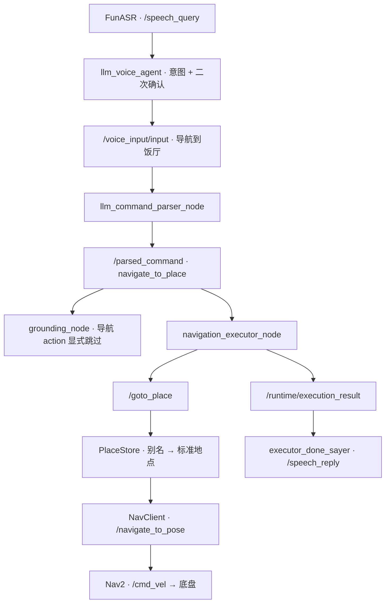

# JetArm Dev Log — 2026-08-08 ～ 2026-08-09

> 项目：JetArm 有限场景真实任务闭环  
> 本周末主题：语音系统升级、命名地点导航、Nav2 一键启动、地图安全修订  
> 记录日期：2026-08-09  
> 文档状态：阶段总结；已将“日志实证”“源码实现”“尚未验证”分开标记

---

## 1. 周末结论摘要

本周末完成了两条此前相互独立的能力链：

1. **PC 侧语音交互**已经从“本地 LLM + 原 TTS”升级为 **FunASR + GLM 云端 + CosyVoice 3**，并完成真实语音问答、流式回复、TTS 播放、唤醒窗口、打断和短控制词放行测试。
2. **Jetson/Orin 侧 Nav2**已经可以通过新的 `nav_bringup` 一条 launch 同时启动底盘、雷达、TF、AMCL、Nav2 和 RViz；实车完成了两段导航，第三段返回卧室时因全局路径不可达而失败。

语音导航的前半段在 2026-08-09 23:48 已经实测打通：

```text
“瑞贝卡，去饭厅”
→ Agent 询问“将前往饭厅，是否确认？”
→ 用户说“确认”
→ FunASR 将短控制词直通
→ llm_voice_agent 发布一次“导航到饭厅”
→ /voice_input/input echo 收到一次
```

但截至本日志结束，**语音还没有真正驱动 Nav2 完成一次实车导航**。当前闭环仍有三个 P0 阻塞项：

- `饭厅` 与标准地点名 `dining_room_1` 的别名映射尚未在已安装版本中验证通过。
- “停止移动 / 停止导航 / 别走”等安全口令还没有全部在 ASR 正常模式和 TTS 播放期间直通。
- `/voice_input/input → /parsed_command → navigation_executor → /goto_place → NavigateToPose` 尚未做同一次运行中的完整实机联调。

因此当前阶段应定义为：

> **语音前端通过 + Nav2 底层通过 + 中间语义执行链已实现并通过离线测试，但端到端实车闭环未验收。**

---

## 2. 本周末目标与范围

### 2.1 目标

- 改善 Rebecca 的对话质量和 TTS 自然度。
- 接入 GLM 云端模型，保留本地 Ollama 作为可选回退。
- 接入 CosyVoice 3，并支持无声 WAV 验证和真实播放。
- 将“去饭厅”等自然语言转换为命名地点导航任务。
- 导航在执行前必须二次确认，停止移动不需要确认。
- 保证导航任务不误入机械臂 Grounding / Runtime。
- 将底盘、雷达、定位和 Nav2 整合为 Orin 一键启动。
- 处理地图中可能造成错误规划或返回失败的边界/缺口。

### 2.2 明确安全边界

- Rebecca、Parser 和 LLM **不直接发布 `/cmd_vel`**。
- 语音系统不生成任意坐标，只能请求 `places.yaml` 中已经保存的命名地点。
- 导航和机械臂共用前半段文本入口，但在 `/parsed_command` 后分流。
- “停止说话 / 安静”只停止 LLM/TTS；“停止移动 / 取消导航”只取消 Nav2，二者必须严格分离。
- 导航确认前不发布执行命令；确认后只发布一次。
- 同一时刻只允许一个导航任务，新的导航任务以 `BUSY` 拒绝，不抢占。
- 实机移动、`/cmd_vel`、长时间 ROS2 进程和 Nav2 目标仍由用户在现场执行。

---

## 3. 系统分工

| 设备 | 本周末职责 |
|---|---|
| PC `sundasheng-OMEN` | FunASR、GLM、CosyVoice、Rebecca、Parser、`place_manager`、语义导航执行器、代码与测试 |
| Jetson/Orin | 底盘驱动、RPLidar、`odom_combined`、TF、AMCL、Nav2、RViz |
| STM32 / 底盘 | 接收 `/cmd_vel` 对应的底盘控制；本轮不允许语音或 LLM 直接访问 |

共同 ROS 配置：

```text
ROS_DOMAIN_ID=23
RMW_IMPLEMENTATION=rmw_cyclonedds_cpp
```

---

## 4. 2026-08-08：GLM + CosyVoice 语音系统升级

### 4.1 环境准备

在 PC 上完成 Miniforge 安装：

```text
Miniforge: 26.3.2
conda base: /home/sundasheng/miniforge3
CosyVoice env: Python 3.10
模型目录: ~/tools/CosyVoice/pretrained_models/Fun-CosyVoice3-0.5B
服务地址: http://127.0.0.1:50000
```

Miniforge 安装包先进行了 SHA-256 校验，校验成功后使用批处理方式安装，并关闭 base 自动激活。

### 4.2 CosyVoice 初始故障

官方 FastAPI `server.py` 能启动并接受 `/inference_zero_shot` 请求，但第一次合成出现：

```text
TypeError: Invalid file: tensor(...)
```

根因是官方服务先把上传的参考音频解码成 Tensor，再把该 Tensor 传给内部仍按“文件路径”读取的 `load_wav()`，导致 `torchaudio/soundfile` 把 Tensor 当作文件名。

后续改为由 ROS 包托管的 `cosyvoice_fp16_server.py` 启动 CosyVoice，并使用与模型接口匹配的零样本参考音频处理路径，不再直接依赖原始官方启动方式。

### 4.3 语音包 v1.1 改动

升级后的 ROS package 版本为 `0.0.3`，核心改动如下：

- LLM 链：`GLM 云端 → 本地 Ollama` 回退。
- 默认模型：`glm-4.5-air`，可切换其他 GLM 模型。
- API Key 只从 `ZHIPUAI_API_KEY` 读取，不进入源码、launch、ROS 参数或日志。
- GLM 使用流式输出，完整句子可以逐句进入 TTS，降低首句等待时间。
- TTS 链：`CosyVoice HTTP → Piper` 回退。
- CosyVoice 输出统一为 `24000 Hz / mono / signed int16 PCM WAV`。
- `play_audio:=false` 时只生成 WAV，不访问声卡。
- TTS 打断时清理旧队列，并阻止残余音频继续播放。
- `/tts/interrupt` 表示真实用户打断，同时停止 TTS 和当前 GLM 请求。
- `/tts/interrupt_playback_only` 只停止旧播放，不取消新的 GLM 请求。
- 每轮 GLM 使用独立取消令牌，避免旧请求在打断后继续向 TTS 写入。
- 任务文本只发布到 `/voice_input/input`，不再同时发送两个 Parser 入口。
- `enable_robot_side_effects` 默认 `false`，默认不创建手势、face-follow 和舵机发布器。
- 新增 `rebecca_voice_start`，托管 API Key、CosyVoice 服务和完整 voice stack。

### 4.4 一键启动器

新增入口：

```bash
ros2 run llm_voice_agent rebecca_voice_start
```

入口行为：

- 首次使用隐藏输入读取 GLM Key。
- Key 保存到 `~/.config/jetarm_voice/secrets.env`，目录权限 `700`，文件权限 `600`。
- 只探测 `127.0.0.1:50000`。
- 若端口已经是 CosyVoice，则复用但不接管。
- 若端口被其他服务占用，则明确失败退出。
- 若服务未启动，则使用 CosyVoice conda Python 以 FP16 启动。
- Ctrl+C 只停止该入口自己启动的进程，不误杀已有 CosyVoice 或其他 Python 进程。

### 4.5 实际验证结果

真实日志证明以下链路通过：

```text
FunASR → /speech_query
GLM(glm-4.5-air) 流式生成
→ /speech_reply
→ CosyVoice 合成
→ WAV/扬声器播放
→ /tts/done
→ 延长唤醒窗口
```

观测到的典型耗时：

- GLM 简短回答：约 `0.3–1.5 s`，复杂回答可更长。
- CosyVoice 短句：约 `0.6–2.0 s`。
- CosyVoice RTF 多数约 `0.27–0.37`。

2026-08-08 17:54 的真实打断测试：

```text
用户：“瑞贝卡停止说话”
→ ASR interrupt 模式命中
→ 发布 /tts/interrupt
→ TTS 停止当前播放
→ /tts/done（打断触发）
→ 后续 CosyVoice 合成结果被丢弃
```

### 4.6 已发现但未完全收口的问题

1. **CosyVoice 服务未启动时**，TTS 会回退 Piper；当 Piper 也返回空音频时，最终报：

   ```text
   all configured TTS backends failed
   ```

2. Ctrl+C 时部分 Python ROS2 节点曾重复调用 `rclpy.shutdown()`：

   ```text
   rcl_shutdown already called on the given context
   ```

   这是退出清理问题，不影响正常运行，但需要统一 shutdown 守卫。

3. CosyVoice 对很短文本会打印 `synthesis text ... too short than prompt text` 警告；当前合成仍成功，但短确认话术的音质需要继续主观验收。

4. 日志中的 HTTP multipart DEBUG 信息过多，应在后续把相关 logger 降到 `INFO/WARN`。

---

## 5. 2026-08-08：语音命名地点导航代码实现

### 5.1 设计决策

最终交互不强制用户先说“进入任务模式”。导航采用自然意图 + 二次确认：

```text
用户：瑞贝卡，去饭厅
Rebecca：将前往饭厅，是否确认？
用户：确认
Rebecca：好的，开始导航。
```

机械臂任务模式仍保留；导航在聊天模式和任务模式都可被识别。

最终约束：

- 导航请求必须先确认。
- 确认/取消只接受明确完整短语，不使用危险的子串匹配。
- 取消优先于确认，避免“不要确认”因包含“确认”而启动。
- 等待确认期间可直接说另一个地点，更新目标后重新询问。
- “停止移动”在任何模式下立即生效，不需要确认。
- 每次确认只保留最近一个待执行命令。

### 5.2 新增或修改的模块

| 模块 | 本轮职责 |
|---|---|
| `llm_parser/navigation_intent.py` | 将导航/取消语句解析为 `navigate_to_place` / `cancel_navigation` |
| `llm_command_parser_node.py` | 优先解析导航，再回退原机械臂指令解析 |
| `llm_voice_agent_node.py` | 导航意图识别、二次确认、取消和单次发布 |
| `grounding_node.py` | 对导航 action 显式 `skip`，避免进入机械臂 Grounding |
| `navigation_executor_node.py` | 消费 `/parsed_command`，调用 `/goto_place` 或 `/cancel_navigation` |
| `goto_place_node.py` | 地点名查表、调用 Nav2、到达状态复核、取消服务 |
| `nav_client.py` | 管理 `NavigateToPose` action goal 和取消 |
| `executor_done_sayer.py` | 把导航 ExecutionResult 翻译为语音结果；避免机械臂重复播报 |
| `place_manager/navigation.launch.py` | 启动 goto、navigation executor 和可选 done sayer |

### 5.3 `/parsed_command` 协议

导航：

```json
{
  "action": "navigate_to_place",
  "place_name": "饭厅",
  "source": "voice",
  "raw_text": "导航到饭厅"
}
```

取消：

```json
{
  "action": "cancel_navigation",
  "source": "voice",
  "raw_text": "停止移动"
}
```

### 5.4 导航执行器状态与错误码

`navigation_executor_node` 复用 `/runtime/execution_result`，并扩展：

```text
action
place_name
status
error_code
```

状态：

```text
SUCCEEDED / FAILED / CANCELLED / REJECTED
```

错误码：

```text
PLACE_NOT_FOUND
NAV2_FAILED
CANCELLED
BUSY
SERVICE_UNAVAILABLE
CANCEL_REJECTED
```

关键语义：

- 有导航在运行时，新目标返回 `BUSY`，不抢占。
- 取消服务接受只表示“取消请求已提交”，不能立即宣布已经停止。
- 必须等待原 Nav2 goal 的终态后再发布 `CANCELLED`。
- 若取消请求发出后机器人已经到达，最终仍应报告 `SUCCEEDED`。
- 同一 `task_id` 只发布/播报一次结果。

### 5.5 到达验证

`goto_place_node` 不只相信 Nav2 action 的成功结果，还结合：

- `/amcl_pose`
- `/odom_combined`
- 位置误差
- 航向误差
- 线速度与角速度
- 稳定保持时间

进行二次到达验证。`odom_topic` 已参数化，当前实机默认显式设置为 `/odom_combined`。

### 5.6 离线测试结果

阶段性验证记录：

| 测试 | 结果 |
|---|---:|
| 4 包构建：`place_manager llm_parser grounding llm_voice_agent` | 通过 |
| `colcon test-result --verbose` | `25 tests, 0 errors, 0 failures, 0 skipped` |
| 新导航测试文件 | `45 passed` |
| 语音安全与回归测试 | `62 passed` |
| `sketch_runtime` 回归 | `133 passed` |
| `git diff --check` | 无空白错误 |

测试覆盖了：

- 导航意图与停止移动意图区分。
- 导航不误入机械臂 Grounding。
- `BUSY` 不抢占。
- 取消请求不提前宣布成功。
- Nav2 最终状态优先于取消动作本身。
- 重复 finalize 不重复发布。
- done sayer 按 `task_id` 去重。
- 畸形 JSON 不导致播报节点崩溃。

### 5.7 当时源码状态

语音导航改动位于：

```text
feature/voice_navigation_integration
```

阶段日志显示：新增 10 个文件、修改 13 个文件，共涉及 23 个文件；当时尚未 commit / push / merge。

既存技术债：

- `llm_voice_agent`、`llm_parser` 等 ament_python 包没有把 pytest 正式接入 `colcon test`，会显示 `Ran 0 tests`；相关测试仍需手动运行。
- 原文件已有大量 flake8/pep257 问题，本轮未扩大范围处理。

---

## 6. 2026-08-09：Orin 网络与一键 Nav2 Bringup

### 6.1 Cyclone DDS 切换

Orin 从 Wi-Fi 切回网线，计划将：

```text
orin_camera_wlan0.xml
```

切换为：

```text
orin_camera_eth0.xml
```

`.zshrc` 已备份并修改，eth0 XML 文件存在，内容也绑定 eth0。

但实际 `nav_bringup` 日志中所有节点仍打印：

```text
file:///home/ubuntu/ros2_ws/config/cyclonedds/orin_camera_wlan0.xml
```

说明启动 Nav2 的那个现有 shell 仍继承了旧环境。此项不能算完全收口；需要在新终端或启动前显式重新 export，并通过进程环境再次确认。

### 6.2 新增 `nav_bringup` 包

新增一条命令启动完整导航底层：

```bash
ros2 launch nav_bringup nav_bringup.launch.py
```

它负责启动：

1. `turn_on_dlrobot_robot/dlrobot_robot_node`
2. `rplidar_ros/rplidar_node`
3. `mobile_base_bridge/odom_tf_bridge_node`
4. `base_footprint → laser` 静态 TF
5. map server + AMCL
6. Nav2 navigation stack
7. RViz2

默认帧链：

```text
map
└── odom_combined
    └── base_footprint
        └── laser
```

### 6.3 串口审计与防误占

已确认：

```text
底盘 MCU: /dev/ttyACM0
USB: 1a86:55d4 (CH343)
```

RPLidar 实际使用稳定 by-id 路径启动：

```text
/dev/serial/by-id/usb-Silicon_Labs_CP2102_USB_to_UART_Bridge_Controller_0001-if00-port0
```

`nav_bringup` 增加了启动前串口检查：

- 路径必须存在。
- 必须是字符设备。
- 底盘和雷达不能解析到同一物理设备。
- 不自动回退 `/dev/ttyUSB*`。
- 拒绝把不稳定的 `/dev/ttyUSB0` 当成雷达。
- `/dev/rplidar_cp2102` 若只是历史 `mknod` 字符节点而非真正 symlink，也应拒绝。

目的：避免雷达节点误占机械臂 CP2102 串口。

### 6.4 Nav2 启动结果

2026-08-09 14:55 使用 by-id 雷达路径启动，以下组件均成功创建：

```text
dlrobot_robot_node
rplidar_node
odom_tf_bridge_node
static_transform_publisher
map_server
amcl
controller_server
smoother_server
planner_server
behavior_server
bt_navigator
waypoint_follower
velocity_smoother
RViz2
```

RPLidar 识别结果：

```text
Firmware: 1.29
scan_mode: Sensitivity
sample_rate: 8 kHz
max_distance: 12.0 m
scan_frequency: 10.0 Hz
```

地图加载：

```text
home_map_clean_02_260705.pgm
374 × 213
0.05 m/cell
origin: [-10.8, -4.88, 0]
```

AMCL 与 Nav2 lifecycle 最终进入 active。

### 6.5 实车导航结果

| 序号 | 起点 → 目标 | 目标坐标 | 结果 |
|---:|---|---|---|
| 1 | `bedroom_sunnysun → dining_room_1` | `(-3.48, -0.44)` | 成功，`Reached the goal / Goal succeeded` |
| 2 | `dining_room_1 → living_room` | `(-5.77, -2.90)` | 成功，`Reached the goal / Goal succeeded` |
| 3 | `living_room → bedroom_sunnysun` | `(-7.05, 1.57)` | 失败，Navfn 无有效路径，随后出现 empty path |

第三段失败日志：

```text
GridBased: failed to create plan with tolerance 0.50
Planning algorithm GridBased failed to generate a valid path
Invalid path, Path is empty
```

这证明问题位于全局地图/代价地图的可达性，而不是语音链路。

### 6.6 运行中警告

- RViz 启动早期有 TF 时间外推和 message filter queue full。
- AMCL 设置初始位姿时有几十毫秒的 future extrapolation，但随后正常设置位姿。
- 第三方 `teb_local_planner_plugin.xml` 缺少 Root Element；当前实际使用 Navfn + DWB，未阻止本次运行，但应清理第三方 overlay。
- Ctrl+C 退出时底盘节点抛出 context invalid，属于 shutdown 清理问题。
- 当行为树仍在执行恢复动作时再次 Ctrl+C，会产生多条取消/退出警告；实车停止前应先取消 goal，再关闭 bringup。

---

## 7. 地图安全修订

### 7.1 背景

原地图 `home_map_clean_02_260705` 在房间—饭厅—客厅路径附近存在边界破碎、未知区缺口和细墙不连续问题。前两段能够通过，但从客厅返回卧室时全局路径最终变成不可达。

### 7.2 生成的候选地图

生成：

```text
home_map_navsafe_01_260809.pgm
home_map_navsafe_01_260809.yaml
```

保持不变的地图元数据：

```yaml
mode: trinary
resolution: 0.05
origin: [-10.8, -4.88, 0]
negate: 0
occupied_thresh: 0.65
free_thresh: 0.25
```

工作区生成了：

- 原图预览。
- 候选地图预览。
- 像素差异图。
- 路径与保存地点叠加图。
- 门洞/边界审查图。
- 修正版压缩包。

### 7.3 当前状态

地图候选经过多轮方向和像素差异复核，但**没有日志证明 Orin 已使用该地图重新完成三段路径**。

因此当前状态为：

> 地图文件已生成并完成离线视觉检查，但尚未部署验收，不能替换原地图作为稳定基线。

正确验收必须至少重跑：

```text
bedroom_sunnysun
→ dining_room_1
→ living_room
→ bedroom_sunnysun
```

并同时检查：

- 全局路径不穿墙。
- 门洞保留足够膨胀余量。
- 返回卧室可规划。
- 激光点云与静态地图继续贴合。
- 机器人实际足迹不会擦碰家具。

---

## 8. 地点管理与自然语言别名

### 8.1 当前标准地点

`places.yaml` 当前包含：

| 标准名 | x | y | yaw |
|---|---:|---:|---:|
| `bedroom_sunnysun` | -7.0480 | 1.5746 | 0.1670 |
| `dining_room_1` | -3.4840 | -0.4355 | -1.5815 |
| `living_room` | -5.7701 | -2.9009 | 3.0840 |
| `dinning_room_2` | 0.8313 | -1.0485 | 0.0124 |
| `kitchen` | 3.5535 | 1.5476 | 0.0441 |

注意：`dinning_room_2` 当前拼写为双 `n`，后续需要决定是否迁移为 `dining_room_2`，避免长期保留错误标准名。

### 8.2 为什么需要别名

语音 Agent 实际发布：

```text
导航到饭厅
```

Parser 产生：

```json
{"action":"navigate_to_place","place_name":"饭厅"}
```

但 `/goto_place` 当前保存的是：

```text
dining_room_1
```

如果没有别名，`PlaceStore.get("饭厅")` 会返回 `None`，最终得到 `PLACE_NOT_FOUND`。

### 8.3 已进行的别名实现

`PlaceStore` 源码中已出现：

- `aliases` 列表读取。
- `alias → canonical_name` 索引。
- 标准名与别名冲突检查。
- 多地点共享别名检查。
- 保存地点时保留已有别名。
- 热重载时重建别名索引。
- 删除标准地点时移除其别名。
- `list_names()` 只返回标准名。

预期 YAML 形式：

```yaml
places:
  dining_room_1:
    x: -3.484027416738046
    y: -0.4355094448549986
    yaw: -1.5815013516434773
    aliases: [饭厅, 餐厅]
```

### 8.4 测试暴露出的安装漂移

一次组合测试结果为：

```text
47 passed, 7 failed
```

7 个失败全部集中在 alias suite。随后检查发现 Python 实际导入的是：

```text
~/ros2_ws/install/place_manager/.../place_store.py
```

而别名实现存在于：

```text
~/ros2_ws/src/place_manager/place_manager/place_store.py
```

说明当时测试加载了旧 install 副本，存在源码/安装漂移。后续尝试用 `PYTHONPATH` 绕过时又因生成的 `place_manager.srv` 不在源码包内而触发：

```text
ModuleNotFoundError: No module named 'place_manager.srv'
```

结论：

> 别名逻辑已经有源码和测试，但用户 ROS2 工作区的已安装包尚未完成一次干净重建和全套复测；当前不能把“饭厅 → dining_room_1”标记为已完成。

---

## 9. 2026-08-09 晚间：自然确认与短语过滤调试

### 9.1 导航确认状态机

最终保留的自然交互：

- 不要求先进入任务模式。
- 识别“去/前往/导航到 + 地点”后进入确认。
- 询问确认时不发布命令。
- “确认/确定/可以/好”等完整确认词触发一次发布。
- “取消/不去/不要/别去/算了”等优先取消。
- 确认阶段说新地点时更新目标并重新询问。
- 确认后清空 pending 状态，防止第二次“确认”重复执行。

### 9.2 机械臂确认安全修复

旧实现使用：

```python
if any(w in norm_text for w in CONFIRM_WORDS):
```

这会让：

```text
不要执行
```

因为包含“执行”而被误判为确认。

现版本调整为：

- 取消优先。
- 确认必须完整短语匹配。
- 先保存命令并清空确认状态，再发布。

因此该安全修复应该保留，不能恢复旧的包含判断。

### 9.3 第一次语音失败：ASR 把“确认”过滤掉

实际链路：

```text
“瑞贝卡去饭厅”
→ Agent 正确回答“将前往饭厅，是否确认？”

“确认”
→ FunASR 正确识别“确认。”
→ 短句过滤器将其丢弃
→ Agent 没收到确认
→ /voice_input/input 无输出
```

当用户改说“确认开始导航”时，ASR 虽然放行，但 Agent 为了安全只接受完整确认短语，因此继续要求说“确认”。两侧规则形成死锁：

```text
ASR 不放行短“确认”
Agent 不接受长“确认开始导航”
```

### 9.4 修复：控制短语白名单优先于短句过滤

在 `speech_dialog_funasr_node.py` 中增加控制回复直通：

```text
确认 / 确定 / 执行 / 好的 / 好 / 行 / OK / 可以 / 是的 / 没问题
取消 / 不去 / 不要 / 别去 / 先不要 / 算了 / 不用 / 停止
```

处理顺序调整为：

```text
ASR 文本归一化
→ 控制短语完整匹配
→ 低置信度检查
→ 控制词直接发布
→ 其他文本才进入口头语清理与 min_text_len 过滤
```

### 9.5 23:48 实测通过

关键日志：

```text
🎧 识别[endpoint] -> '确认。' (conf~1.00)
🎛️ 控制短语直通：确认。 -> 确认
🗣️ 发布: 确认。
🗨️ /speech_reply <= 好的，开始导航。
✅ 下发命令到 ['/voice_input/input']: 导航到饭厅
```

监听终端收到：

```yaml
data: 导航到饭厅
---
```

该测试证明：

- ASR 已放行“确认”。
- Agent 保持二次确认。
- 确认前未向任务入口发布。
- 确认后只向 `/voice_input/input` 发布。
- 至少在该次日志中只出现一次发布。

---

## 10. 当前完整 Text / Voice → Nav2 链路



注意：

- `grounding_node` 与 `navigation_executor_node` 是并行订阅 `/parsed_command`，不是串联。
- Grounding 收到导航 action 后只记录并返回，不发布机械臂 Grounding 结果。
- `navigation_executor_node` 才是语义导航执行入口。
- `/goto_place` 查表后才生成 Nav2 goal。
- 只有 Nav2 能通过控制器发布 `/cmd_vel`。

### 10.1 节点职责表

| 节点 | 订阅/输入 | 发布/输出 | 状态 |
|---|---|---|---|
| `speech_dialog_funasr_node` | 麦克风、`/tts_speaking` | `/speech_query`、`/tts/interrupt` | 真实语音已运行 |
| `llm_voice_agent` | `/speech_query`、`/tts/done` | `/speech_reply`、`/voice_input/input` | 导航确认前半段已通过 |
| `llm_command_parser_node` | `/voice_input/input`、`/keyboard_input/input` | `/parsed_command` | 源码与单测通过；未与本次语音同场联调 |
| `grounding_node` | `/parsed_command` | 机械臂 Grounding topics | 导航 skip 已实现 |
| `navigation_executor_node` | `/parsed_command` | `/goto_place`、`/cancel_navigation`、execution result | 离线测试通过，未实车联调 |
| `goto_place_node` | services、AMCL、odom | `NavigateToPose` goal | 代码完成；标准名 service 曾单独验证 |
| `Nav2` | `NavigateToPose` | `/cmd_vel` | 底层三段测试 2 成功、1 失败 |
| `executor_done_sayer` | `/runtime/execution_result` | `/speech_reply` | 离线去重测试通过 |

---

## 11. Text input 现状

当前存在话题不一致：

```text
keyboard_input_node 发布：/text_input
Parser 订阅：/keyboard_input/input 和 /voice_input/input
```

因此 `/text_input` 默认不能进入 Parser。

临时方案：

```bash
ros2 run keyboard_input keyboard_input_node \
  --ros-args \
  -r /text_input:=/keyboard_input/input
```

长期方案：把 keyboard 节点的发布话题统一为：

```text
/keyboard_input/input
```

语音继续只使用：

```text
/voice_input/input
```

不能重新让 Agent 同时发布两个入口，否则同一条命令会被 Parser 解析两次。

---

## 12. 当前状态矩阵

| 能力 | 状态 | 证据/说明 |
|---|---|---|
| FunASR 普通语音识别 | ✅ 已验证 | 多轮真实 endpoint 日志 |
| 唤醒词与 wake window | ✅ 已验证 | L3_WAKE 20 s 开窗，TTS done 延长 |
| GLM 云端对话 | ✅ 已验证 | `glm-4.5-air` 真实流式回复 |
| CosyVoice 3 合成与播放 | ✅ 已验证 | 多条 TTS 合成、WAV 和 done 日志 |
| “停止说话”打断 TTS | ✅ 已验证 | interrupt 命中并停止播放 |
| 导航自然意图 + 二次确认 | ✅ 已验证到文本发布 | “去饭厅 → 确认 → /voice_input/input” |
| 确认短语直通 | ✅ 已验证 | 23:48 实测日志 |
| 机械臂确认完整匹配 | ✅ 源码已修 | 尚需补自动测试覆盖“不要执行” |
| Navigation Parser | 🟡 单测通过 | 仍有直接文本误判案例 |
| Grounding 导航跳过 | ✅ 源码/测试通过 | 不进入机械臂 Grounding |
| Navigation Executor | 🟡 离线通过 | 尚未实机联调 `/goto_place` |
| `/goto_place` 标准名导航 | 🟡 已有基础验证 | 语音中文别名仍未收口 |
| 地点 aliases | 🟠 源码存在 | install 漂移；7 项测试失败，未重建验收 |
| Nav2 bringup | ✅ 已验证 | 一条 launch 启动完整底层 |
| Nav2 实车导航 | 🟡 部分通过 | 2 段成功，返回卧室失败 |
| navsafe 地图 | 🟠 文件已生成 | 未部署、未重跑路径 |
| Voice → Nav2 实车闭环 | ❌ 未完成 | 未在同一次运行中验证全链 |

---

## 13. 未实现 / 未验收问题清单

### P0 — 实车语音导航前必须解决

#### P0-1：中文地点别名尚未成为运行时事实

当前：

```text
语音发布：饭厅
标准地点：dining_room_1
```

必须完成：

1. 在 `places.yaml` 增加 `饭厅/餐厅` 等别名。
2. 干净重建 `place_manager`。
3. 确认实际导入的是新 install 版本。
4. 运行 alias 全套测试为 0 failure。
5. 只读验证 `PlaceStore.get("饭厅") == PlaceStore.get("dining_room_1")`。

#### P0-2：停止移动安全口令未完整穿透 ASR

当前白名单解决了“确认/取消”，但以下词仍可能受 `min_text_len=5` 影响：

```text
停止移动
停止导航
取消导航
别走
别走了
不要走
```

并且 TTS 播放期间 ASR 仍是 interrupt-only；当前“停止移动”可能只被当成非打断语句丢弃，无法送到 Agent。

必须完成：

- 正常模式：移动停止词全部直通。
- TTS 播放期间：命中移动停止词时同时停止 TTS，并发布到 `/speech_query`。
- 保持“停止说话”与“停止移动”两套词表隔离。
- 增加自动测试覆盖 TTS 正在播放时的 `停止移动`。

#### P0-3：完整链路未同场验收

还没有一份日志同时包含：

```text
/voice_input/input
→ /parsed_command
→ navigation_executor
→ /goto_place
→ NavigateToPose
→ Goal succeeded
→ /runtime/execution_result
→ 已经到达饭厅
```

### P1 — 影响可靠性

#### P1-1：Parser 的直接文本导航误判

当前 `navigation_intent.py` 对直接文本存在：

| 输入 | 当前结果 | 问题 |
|---|---|---|
| `导航到饭厅` | `饭厅` | 正确 |
| `去饭厅吧` | `饭厅吧` | 尾部语气词未清理 |
| `去年天气怎么样` | `年天气怎么样` | “去”前缀误判 |
| `到底怎么回事` | `底怎么回事` | “到”前缀误判 |
| `去右边` | `右边` | 与机械臂方向冲突 |

Agent 已实现上述保护并会发布规范化的 `导航到饭厅`，所以当前语音主路径风险较低；但键盘输入或其他节点直接发文本时仍可能误判。Parser 应同步 Agent 的规则，并补回归测试。

#### P1-2：`/text_input` 与 Parser 入口不一致

需要正式统一 topic，避免每次依赖 remap。

#### P1-3：DDS 配置表面切到 eth0，运行时仍使用 wlan0 XML

必须检查实际进程环境，而不是只检查 `.zshrc` 文件内容。

#### P1-4：客厅返回卧室无法规划

原地图上第三段返回失败；需要使用候选 navsafe 地图重跑，或者重新检查目标点是否落入膨胀区/不可达区域。

#### P1-5：navsafe 地图未实车验证

在完成往返验证前不能替换稳定地图。

### P2 — 工程质量与后续优化

- `min_text_len` 默认值仍为 `5`；需要结合白名单决定是否改为 `3`，并验证不会显著增加误触发。
- `dinning_room_2` 拼写错误需迁移策略。
- 第三方 TEB plugin XML 损坏警告需要清理。
- RViz/TF 启动阶段 message filter 与 future extrapolation 需要观察是否只发生在启动瞬间。
- Ctrl+C shutdown 的重复 `rcl_shutdown` / context invalid 需要修复。
- HTTP multipart DEBUG 日志过多。
- ament_python 包的 pytest 尚未正式接入 `colcon test`。
- 大量既存 flake8/pep257 技术债未处理。
- 语音回答仍可能出现不自然标点，例如句尾 `，。`，需要在 TTS 前清洗。
- CosyVoice 极短文本警告与短句音质仍需主观调音。
- `enable_robot_side_effects=false` 只禁止 Agent 直发手势/舵机，不能禁止确认后的任务文本进入执行链；后续可考虑统一的机器人总执行使能开关。

### 关联但独立的 PC 环境问题

同周末还定位到 NVIDIA 驱动无法加载：

```text
kernel: 6.8.0-136-generic
nvidia.ko: 550.163.01
modprobe nvidia: Key was rejected by service
Secure Boot: enabled
```

根因指向 Secure Boot/MOK 签名未被固件信任。该问题与语音导航逻辑无关，但可能影响依赖 GPU 的本地推理或 CosyVoice 稳定性；MOK 导入/重启登记尚未形成最终成功记录。

---

## 14. 下一步推荐执行顺序

### 阶段 A：修复 P0，不启动 Nav2

1. 完成 `PlaceStore` alias 代码与 `places.yaml` 别名。
2. 干净重建 `place_manager`，确认 import 指向 install 新版本。
3. 全量运行 alias、导航意图、取消语义和 done sayer 测试。
4. 补齐 ASR 的所有移动停止词与 TTS 播放期间直通。
5. 修复 Parser 的尾词、`去年/到底` 和左右方向误判。

### 阶段 B：只验证文本结构化，不启动执行器

启动 Parser：

```bash
ros2 run llm_parser llm_command_parser_node
```

监听：

```bash
ros2 topic echo /parsed_command
```

发布：

```bash
ros2 topic pub --once \
  /voice_input/input \
  std_msgs/msg/String \
  "{data: '导航到饭厅'}"
```

预期仅出现一次：

```json
{"action":"navigate_to_place","place_name":"饭厅",...}
```

此阶段不要运行 `navigation_executor_node`，小车不会移动。

### 阶段 C：服务和地点解析检查

验证：

- `/goto_place` 存在。
- `/cancel_navigation` 存在。
- `饭厅` 能解析到 `dining_room_1` 坐标。
- `/navigate_to_pose` action 可见。
- PC 与 Orin 的 `ROS_DOMAIN_ID/RMW/CYCLONEDDS_URI` 一致。

### 阶段 D：Nav2 地图往返验证

先不接语音，用 RViz 或标准 action 重新跑：

```text
卧室 → 饭厅 → 客厅 → 卧室
```

确定原地图或 navsafe 地图哪一版能够稳定返回，并固定地图基线。

### 阶段 E：完整实车语音导航

建议启动顺序：

1. Orin：`nav_bringup`。
2. PC：`llm_command_parser_node`。
3. PC：`place_manager navigation.launch.py launch_done_sayer:=false`。
4. PC：`rebecca_voice_start`。
5. 同时监听 `/voice_input/input`、`/parsed_command`、`/runtime/execution_result`。
6. 先测试“去饭厅 → 取消”。
7. 再测试“去饭厅 → 确认”。
8. 导航过程中测试“停止移动”。
9. 确认停止结果只播报一次。

正式通过标准：

```text
确认前：无 /parsed_command 导航执行
确认后：每层只出现一次任务
地点别名：饭厅 → dining_room_1
Nav2：Goal succeeded
结果：SUCCEEDED
播报：已经到达饭厅
停止：任何播放状态下均能取消
重复确认：不重复执行
```

---

## 15. 最终阶段判断

本周末的最大进展不是单个节点“能跑”，而是已经形成了可审计的分层架构：

```text
自然语音
→ 安全确认
→ 结构化导航意图
→ 命名地点查表
→ Nav2 标准 Action
→ 到达复核
→ 结构化结果
→ 语音反馈
```

当前已经完成并有日志证明的是两端：

- **语音 → 确认后文本发布**。
- **Nav2 → 实车移动并到达部分目标**。

下一阶段不应继续大范围新增功能，而应优先打通并验收中间三处接口：

```text
中文地点别名
Parser / Executor 同场运行
停止移动全路径直通
```

完成这三项后，Rebecca 才能从“会说导航命令”升级为“能够安全、自然、可取消地控制 Nav2”。
