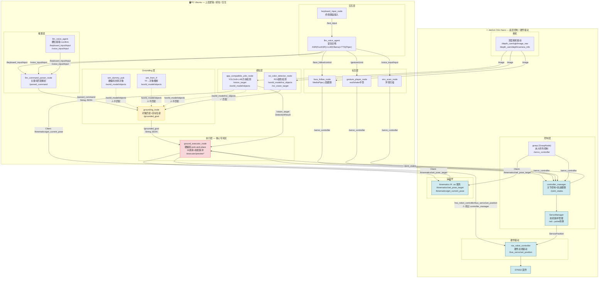
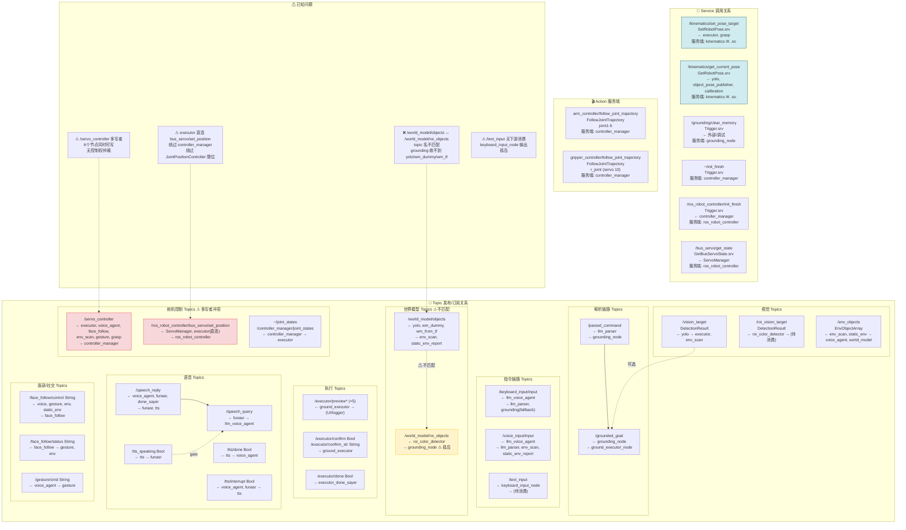
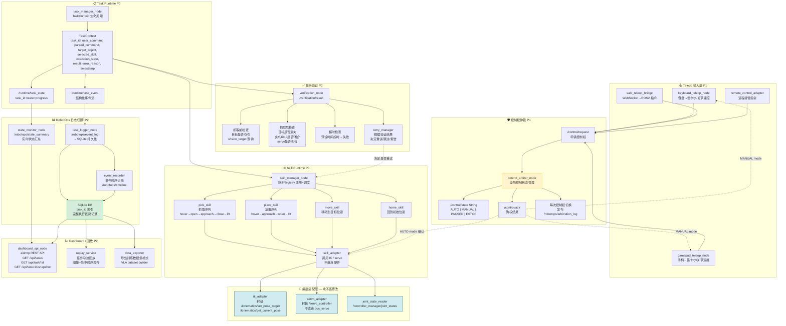
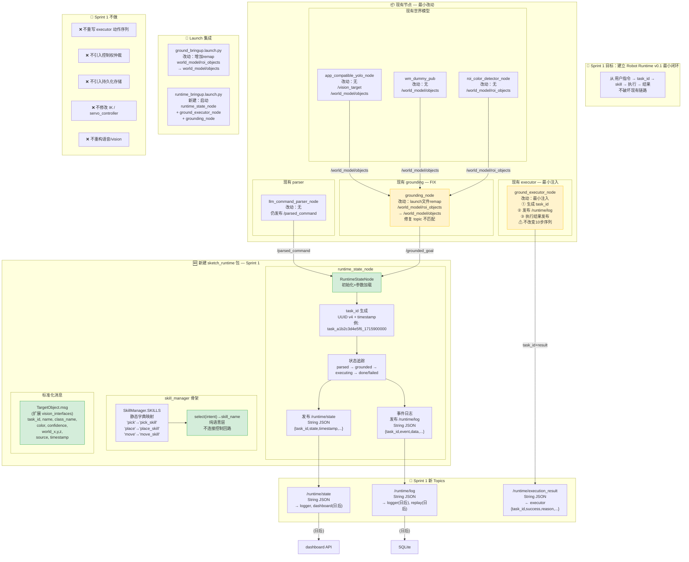

# JetArm Robot Runtime — Architecture Diagrams

> 基于 runtime_analysis.md、topic_service_map.md、refactor_plan.md 的图形化表达
> 使用 Mermaid graph TD 语法，全部为 Markdown 内嵌文本图

---

## 1. 系统总体架构图



---

## 2. 用户指令执行链路图

```mermaid
graph TD
    subgraph INPUT["输入入口"]
        VOICE_MIC["🎤 麦克风<br/>PCM 16kHz Mono"]
        KEYBOARD_IN["⌨️ 键盘终端"]
    end

    subgraph ASR["语音识别 llm_voice_agent"]
        VAD["WebRTC VAD<br/>aggressiveness=3"]
        FUNASR["FunASR<br/>paraformer-large<br/>+ fsmn_vad + punc"]
        WAKE["Wake Word 检测<br/>rebecca / 瑞贝卡"]
        FILTER["后处理<br/>self-speech suppress<br/>confidence≥0.75<br/>≥4 chars"]
        ASR_OUT["/speech_query"]
    end

    subgraph VA_AGENT["llm_voice_agent Node"]
        LAYERS["L1 pause/resume<br/>L2 wake/sleep<br/>L3 mute/unmute"]
        MODE["mode: chat | task"]
        SLOT_EXTRACT["槽位提取<br/>COLOR_MAP+CLASS_MAP+SIDE_MAP"]
        CONFIRM["确认对话<br/>confirm/cancel"]
        VA_PUB["/voice_input/input<br/>/keyboard_input/input"]
    end

    subgraph PARSER_STAGE["指令解析 llm_parser"]
        NORM["re.sub 去中文间空格<br/>(Vosk分词残留)"]
        PARSE_FN["parse() 关键词匹配<br/>颜色→COLOR_MAP<br/>类别→CLASS_MAP<br/>目标→SIDE_MAP"]
        CMD_ASSEMBLE["组装<br/>action='pick' (固定)<br/>from='red_cube'<br/>to='right_side'"]
        PARSE_OUT["/parsed_command<br/>String JSON"]
    end

    subgraph GROUNDING_STAGE["Grounding grounding_node"]
        SPLIT_FROM["split_from_token(from)<br/>→ class, color"]
        SEL_OBJ["_select_object()<br/>模糊子串匹配<br/>按confidence↓/recency↓/proximity↑排序"]
        PLACE_MAP["place_map[to_side]<br/>→ target_pose<br/>frame+xyz+rpy"]
        VALIDATE["规则校验<br/>pick: need obj+target<br/>place: need obj<br/>move: need target"]
        GOAL_OUT["/grounded_goal<br/>String JSON<br/>{intent,object_id,source_pose,target_pose,status}"]
    end

    subgraph EXECUTOR_STAGE["执行器 ground_executor_node"]
        VALIDATE_GOAL["status='ok'?<br/>去重 800ms<br/>busy check"]
        VISION_CONF["可选视觉确认<br/>_vision_confirm()<br/>/vision_target"]
        BUILD_STEPS["硬编码10步序列"]
        IK_CALL["对每步move调IK<br/>/kinematics/set_pose_target<br/>position+pitch+range+resolution"]
        CH5_MAP["_yaw_to_ch5()<br/>rpy[2]→腕部脉冲<br/>clip±45°"]
        PREVIEW["发布预览×5 topic<br/>/executor/preview*"]
        WAIT_CONF["等待确认<br/>/executor/confirm Bool<br/>/executor/confirm_str String"]
        EXEC_STEPS["_exec_move() + _exec_gripper()"]
        MONITOR["_wait_motion_and_settle()<br/>读 /controller_manager/joint_states"]
    end

    subgraph IK_STAGE["逆运动学 kinematics"]
        IK_SOLVE["IK .so 求解<br/>SetRobotPose.srv<br/>position pitch pitch_range resolution"]
        PULSE_OUT["pulse[]<br/>[p1,p2,p3,p4,p5]"]
    end

    subgraph SERVO_STAGE["舵机控制层 servo_controller"]
        CM_PROC["controller_manager<br/>处理 ServosPosition<br/>pulse|rad|deg→pulse"]
        SM_PROC["ServoManager<br/>钳位 duration [0.02,30]s<br/>钳位 position [0,1000]"]
        PUB_CMD["/ros_robot_controller/bus_servo/set_position<br/>ServosPosition"]
    end

    subgraph HW_STAGE["硬件执行"]
        RRC_DRV["ros_robot_controller<br/>硬件驱动"]
        STM32_FW["STM32 固件"]
        SERVOS["舵机 1-5 臂<br/>舵机 10 夹爪"]
    end

    %% 连线
    VOICE_MIC --> VAD
    VAD --> FUNASR
    FUNASR --> WAKE
    WAKE --> FILTER
    FILTER --> ASR_OUT
    ASR_OUT --> LAYERS
    KEYBOARD_IN --> NORM

    LAYERS --> MODE
    MODE -->|"task mode"| SLOT_EXTRACT
    SLOT_EXTRACT --> CONFIRM
    CONFIRM --> VA_PUB

    VA_PUB -->|"/keyboard_input/input"| NORM
    NORM --> PARSE_FN
    PARSE_FN --> CMD_ASSEMBLE
    CMD_ASSEMBLE --> PARSE_OUT

    PARSE_OUT --> SPLIT_FROM
    SPLIT_FROM --> SEL_OBJ
    SEL_OBJ --> PLACE_MAP
    PLACE_MAP --> VALIDATE
    VALIDATE --> GOAL_OUT

    GOAL_OUT --> VALIDATE_GOAL
    VALIDATE_GOAL --> VISION_CONF
    VISION_CONF --> BUILD_STEPS
    BUILD_STEPS --> IK_CALL
    IK_CALL --> PULSE_OUT
    PULSE_OUT --> CH5_MAP
    CH5_MAP --> PREVIEW
    PREVIEW --> WAIT_CONF
    WAIT_CONF --> EXEC_STEPS
    EXEC_STEPS --> MONITOR

    PULSE_OUT -.-> CM_PROC
    EXEC_STEPS -->|"/ros_robot_controller/bus_servo/set_position<br/>⚠ 直连硬件总线"| SM_PROC
    CM_PROC --> SM_PROC
    SM_PROC --> PUB_CMD
    PUB_CMD --> RRC_DRV
    RRC_DRV --> STM32_FW
    STM32_FW --> SERVOS

    style IK_SOLVE fill:#d1ecf1,stroke:#0c5460
    style CM_PROC fill:#d1ecf1,stroke:#0c5460
    style SM_PROC fill:#d1ecf1,stroke:#0c5460
    style RRC_DRV fill:#d1ecf1,stroke:#0c5460
    style STM32_FW fill:#d1ecf1,stroke:#0c5460
    style SERVOS fill:#d1ecf1,stroke:#0c5460
    style BUILD_STEPS fill:#f8d7da,stroke:#dc3545
    style EXEC_STEPS fill:#f8d7da,stroke:#dc3545
```



---

## 3. 当前系统 Topic / Service 流图



---

## 4. Teleop 与 RobotOps 未来架构图



---

## 5. Sprint 1 重构目标图



---

## 6. 感知链路重构 — Raw Detection → Stable World Model

> **现状**: `/world_model/roi_objects` 是原始检测流 — 同一物体在不同帧之间 class/color 跳变（cup red → cup black → cylinder red）。YOLO `/world_model/objects` 提供稳定语义类名但无颜色/可靠位姿。
> **目标**: YOLO + ROI 在 Grounding 之前融合 → StableObjectTracker 时序稳定 → 供 Grounding 消费。

```mermaid
graph TD
    subgraph CURRENT["🔴 旧架构 (Sprint 5 之前)"]
        CAM1["深度相机"]
        ROI1["roi_color_detector_node"]
        WM_RAW1["/world_model/roi_objects<br/>RAW JSON"]
        GND1["grounding_node"]
        RT1["Runtime"]
    end

    subgraph TARGET["🟢 目标架构 (Sprint 5)"]
        CAM2["深度相机"]
        YOLO2["yolo_node<br/>YOLOv8 语义检测"]
        ROI2["roi_color_detector_node<br/>ROI 颜色+位姿"]
        WM_YOLO["/world_model/objects<br/>YOLO JSON"]
        WM_RAW2["/world_model/roi_objects<br/>RAW JSON"]
        FUSION["perception_fusion_node<br/>空间匹配 + 融合"]
        WM_FUSED["/world_model/perception_objects<br/>Fused JSON"]
        TRACKER["StableObjectTracker<br/>═════════════<br/>Temporal Voting<br/>EMA Confidence Smoothing<br/>Object TTL (timeout)"]
        WM_STABLE["/world_model/stable_objects<br/>Stable JSON"]
        GND2["grounding_node<br/>(改用 stable_objects)"]
        RT2["Runtime → ActionExecutor → IK/Servo"]
    end

    CAM1 --> ROI1 --> WM_RAW1 --> GND1 --> RT1
    CAM2 --> YOLO2 --> WM_YOLO --> FUSION
    CAM2 --> ROI2 --> WM_RAW2 --> FUSION
    FUSION --> WM_FUSED --> TRACKER --> WM_STABLE --> GND2 --> RT2

    style CURRENT fill:#f8d7da,stroke:#dc3545
    style TARGET fill:#d4edda,stroke:#28a745
    style FUSION fill:#fff3cd,stroke:#ffc107
    style TRACKER fill:#d1ecf1,stroke:#0c5460
    style WM_STABLE fill:#fff3cd,stroke:#ffc107
```



**StableObjectTracker 核心逻辑**:
- 每帧接收 RAW detections → 与已知 track 匹配 (空间距离)
- 同一 track 的 class/color 做多数投票 (Temporal Voting, 窗口=20 帧)
- confidence 做 EMA 平滑 (α=0.2)
- 连续未检测 → TTL 超时移除 (3 秒)
- 输出 `/world_model/stable_objects`


---

## 7. Perception Fusion Policy

> **生效日期**: Sprint 5.4

### Fusion Pipeline

```
YOLO /world_model/objects           ROI /world_model/roi_objects
  (semantic class_name)               (color, pose.xyz, pose.rpy)
        │                                      │
        └──────────────┬───────────────────────┘
                       ▼
           perception_fusion_node
               │
               ▼
    /world_model/perception_objects
               │
               ▼
        StableObjectTracker
               │
               ▼
    /world_model/stable_objects
               │
               ▼
           grounding → Runtime
```

### Source Priority

| Source | Trusted For | Reason |
|--------|-------------|--------|
| YOLO   | semantic class_name | YOLOv8 provides stable COCO-class labels; not dependent on lighting |
| ROI    | color, pose.xyz, pose.rpy | LAB + geometric projection provides accurate world coordinates and yaw |
| ROI    | fallback class_name | Some objects (red cubes/blocks) are not in YOLO's vocabulary → ROI shape classifier as fallback |

**Note**: ROI class_name is lower trust than YOLO. ROI shape/color classification is known to be unstable across frames (Sprint 5.3 deferred). Strategic decision: YOLO semantic priority, ROI spatial/color priority.

### Fusion Rules

| Match | class_name | color | pose | source | Extra fields |
|-------|-----------|-------|------|--------|-------------|
| YOLO + ROI (dist < 0.06m) | YOLO | ROI | ROI (xyz+rpy) | `yolo_roi_fused` | `yolo_class`, `roi_class`, `match_distance` |
| ROI only | ROI | ROI | ROI | `roi_only` | — |
| YOLO only | YOLO | `unknown` | YOLO | `yolo_only` | — |

### Design Rationale

- **YOLO semantic priority**: YOLO correctly identifies "cup" while ROI may call it "cylinder" or "cube" due to shape classification instability.
- **ROI spatial priority**: ROI's `_pix_to_world()` via static `transform.yaml` provides reliable world coordinates without IK dependency. YOLO's `_pix_to_world_on_plane()` requires a live `/kinematics/get_current_pose` call.
- **ROI-only fallback kept enabled**: Red cubes/blocks are not in YOLO's COCO whitelist. ROI shape classifier remains the only detector for these objects. ROI color is essential for color-based queries ("red cube").
- **StableObjectTracker runs after fusion**: Temporal voting and EMA smoothing occur on fused output, not on raw ROI. This prevents stabilizing wrong ROI-only labels before YOLO semantic correction is applied.

---

## 图例说明

| 颜色 | 含义 |
|------|------|
| 🔵 蓝色边框 | 底层硬件/驱动 — 永不应修改 |
| 🟡 黄色填充 | 需要修复/重构的模块 (Sprint 1) |
| 🔴 红色填充 | 当前高风险区域 (硬编码/冲突) |
| 🟢 绿色填充 | Sprint 1 新建模块 |
| ⚠ 标记 | 已知 Bug / 安全风险 |
