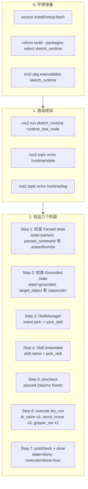

# Robot Runtime v0.1 — Debug Guide

> 面向真实 ROS2 终端调试，逐步验证 Runtime 全链路
> 所有命令在 `dry_run=True` 模式下执行，不移动真实舵机

---

## 1. 构建

```bash
cd ~/ros2_ws
source install/setup.bash 2>/dev/null || true

# 只构建 sketch_runtime
colcon build --packages-select sketch_runtime --symlink-install

# 确认构建成功（无红字错误）
# 输出末尾应有: Summary: 1 package finished

source install/setup.bash
```

---

## 2. 源环境

```bash
source /opt/ros/humble/setup.bash    # 或 jazzy / iron
source ~/ros2_ws/install/setup.bash
```

验证包可用：
```bash
ros2 pkg list | grep sketch_runtime
# 期望输出: sketch_runtime

ros2 pkg executables sketch_runtime
# 期望输出: sketch_runtime runtime_test_node
```

---

## 3. 启动

### 3.1 启动 runtime_test_node（单次执行，默认模式）

```bash
ros2 run sketch_runtime runtime_test_node
```

**期望输出**（启动时）：

```
[INFO] [runtime_test_node]: ============================================================
[INFO] [runtime_test_node]:  RuntimeTestNode started --- DRY_RUN --- ONCE
[INFO] [runtime_test_node]:  test_command  = pick red cup to right side
[INFO] [runtime_test_node]:  run_once      = True
[INFO] [runtime_test_node]:  interval_sec  = 1.0
[INFO] [runtime_test_node]:  dry_run       = True
[INFO] [runtime_test_node]:  Registered skills: ['pick_skill']
[INFO] [runtime_test_node]: ============================================================
```

### 3.2 启动 runtime_test_node（自定义指令）

```bash
ros2 run sketch_runtime runtime_test_node --ros-args \
  -p test_command:="grasp blue ball left side" \
  -p hover_height:=0.10 \
  -p approach_z:=0.02
```

### 3.3 通过 launch 单次执行

```bash
ros2 launch sketch_runtime runtime_test.launch.py run_once:=true
```

自定义指令 + 单次：
```bash
ros2 launch sketch_runtime runtime_test.launch.py \
  test_command:="pick yellow box center" \
  run_once:=true
```

### 3.4 循环执行模式

```bash
ros2 launch sketch_runtime runtime_test.launch.py run_once:=false interval_sec:=2.0
```

每 2 秒执行一次完整 Runtime 链路，持续运行直到 Ctrl+C。

自定义指令 + 循环：
```bash
ros2 launch sketch_runtime runtime_test.launch.py \
  test_command:="grasp blue ball" \
  run_once:=false \
  interval_sec:=3.0
```

### 3.5 非 dry_run 模式（慎用 — 会连接真实硬件）

```bash
ros2 launch sketch_runtime runtime_test.launch.py dry_run:=false
```

> ⚠ 仅在确认 servo_controller 和 IK service 安全可用时使用。

### 3.6 集成 ground + runtime bringup（推荐调试方式）

一次性启动 parser + grounding + world_model + runtime 桥接节点：

```bash
ros2 launch sketch_runtime ground_runtime_bringup.launch.py
```

默认参数：`dry_run:=true` `run_once:=true` `use_dummy_wm:=true`

自定义指令 + 单次执行：
```bash
ros2 launch sketch_runtime ground_runtime_bringup.launch.py \
  use_dummy_wm:=true \
  dry_run:=true \
  run_once:=true
```

> 与 `ground_bringup.launch.py` 的区别：
> - `ground_bringup.launch.py` 只启动 parser / grounding / world_model
> - `ground_runtime_bringup.launch.py` 额外启动 `real_grounded_runtime_node`，将 grounding 输出接入 Runtime Skill 执行链

### 3.7 启用 publish_runtime（grounding → Runtime 桥接）

`real_grounded_runtime_node` 订阅 `/grounded_task_context`，该 topic 由 `grounding_node` 在 `publish_runtime=true` 时发布。

**方式 1 — grounding_params.yaml（推荐，已默认开启）**：
```yaml
# grounding/config/grounding_params.yaml
grounding_node:
  ros__parameters:
    publish_runtime: true    # ← 已在 Sprint 4.1 设为 true
```

**方式 2 — 命令行覆盖**：
```bash
ros2 run sketch_runtime real_grounded_runtime_node --ros-args -p dry_run:=true
# 另开终端：
ros2 run grounding grounding_node --ros-args -p publish_runtime:=true
```

**方式 3 — 带参数的 launch**：
```bash
ros2 launch sketch_runtime ground_runtime_bringup.launch.py
# grounding_params.yaml 已默认 publish_runtime:=true
```

**验证发布**：
```bash
ros2 topic echo /grounded_task_context
```

期望看到 grounding 匹配到对象后发布的 JSON:
```json
{
  "intent": "pick",
  "parsed_command": {"action":"pick","from":"red_cup",...},
  "target_object": {"class_name":"cup","color":"red","world_x":0.15,...},
  "target_pose": {"frame":"table","xyz":[0.2,-0.15,0.02],...},
  "status": "ok"
}
```

### 3.8 Preview / Confirm 安全层（默认开启）

`real_grounded_runtime_node` 在 `require_confirm=True`（默认）时，接收到 `/grounded_task_context` 后会先发布预览，等待用户确认后才执行 Skill。

**监听预览**：
```bash
ros2 topic echo /runtime/preview
```

期望输出：
```json
{
  "task_id": "task_a1b2c3d4_1715900000",
  "intent": "pick",
  "selected_skill": "pick_skill",
  "target_object": {"class_name":"cup","color":"red",...},
  "target_pose": {...},
  "dry_run": true,
  "require_confirm": true,
  "summary": "pick_skill: cup (red)",
  "status": "waiting_confirm",
  "timestamp": 1715900005.0
}
```

**确认执行（简单方式 — 推荐）**：
```bash
ros2 topic pub --once /runtime/confirm std_msgs/msg/String 'data: "yes"'
# 支持: yes y true ok confirm go
```

**取消执行（简单方式）**：
```bash
ros2 topic pub --once /runtime/confirm std_msgs/msg/String 'data: "no"'
# 支持: no n false cancel stop
```

**确认执行（task_id 精确方式）**：
```bash
ros2 topic pub --once /runtime/confirm std_msgs/msg/String \
  'data: "{\"task_id\":\"task_a1b2c3d4_1715900000\",\"confirm\":true}"'
```

**取消执行（task_id 精确方式）**：
```bash
ros2 topic pub --once /runtime/confirm std_msgs/msg/String \
  'data: "{\"task_id\":\"task_a1b2c3d4_1715900000\",\"confirm\":false}"'
```

**超时**：`confirm_timeout_sec` 秒内未收到确认即自动取消（默认 300 秒 = 5 分钟）。

**跳过确认**（直接自动执行）：
```bash
ros2 launch sketch_runtime ground_runtime_bringup.launch.py require_confirm:=false
```

**完整安全流**：
```
/grounded_task_context
  → /runtime/preview  (waiting_confirm)
  → /runtime/confirm  (用户确认)
  → Skill execution   (dry_run)
  → /executor/done
```

### 3.9 RuntimeAdapter 安全状态（新增）

`RuntimeAdapter` 通过 3 个参数控制硬件连接级别：

| dry_run | enable_real_ik | enable_real_servo | IK 行为 | Servo 行为 | 用途 |
|---------|---------------|-------------------|---------|-----------|------|
| `true` | 忽略 | 忽略 | mock `[500,500,500,500,500]` | 日志不发布 | 默认调试 |
| `false` | `false` | `false` | 报错: enable_real_ik false | 报错 | 无效组合 |
| `false` | `true` | `false` | 调用真实 IK 服务，记录脉冲 | 日志不发布 | **IK 验证模式（推荐用于实机调试）** |
| `false` | `true` | `true` | 调用真实 IK 服务 | 发布到 `/servo_controller` | ⚠ 全实物（慎用） |

**IK 验证模式示例**（调用真实 IK 但不发 servo）：

```bash
ros2 launch sketch_runtime ground_runtime_bringup.launch.py \
  dry_run:=false \
  enable_real_ik:=true \
  enable_real_servo:=false \
  require_confirm:=true
```

期望在 adapter 日志中看到真实脉冲值：
```
[RuntimeAdapter] ik_solve OK → pulses=[512, 580, 145, 130, 512]
[RuntimeAdapter] servo_move pulses=[512, 580, 145, 130, 512] duration_ms=2000 mode=LIVE: ik=REAL servo=OFF
```

**全实物模式**（⚠ 仅确认硬件安全后使用）：

```bash
ros2 launch sketch_runtime ground_runtime_bringup.launch.py \
  dry_run:=false \
  enable_real_ik:=true \
  enable_real_servo:=true \
  require_confirm:=true
```

---

## 4. Topic 监听命令（另开终端）

### 终端 A: 运行测试节点（单次）

```bash
ros2 launch sketch_runtime runtime_test.launch.py run_once:=true
```

循环模式：

```bash
ros2 launch sketch_runtime runtime_test.launch.py run_once:=false interval_sec:=2.0
```

### 终端 B: 监听 Runtime state
```bash
ros2 topic echo /runtime/state
```

**期望输出**（每个 state 一次）：
```json
{"task_id":"task_a1b2c3d4e5f6_1715900000","state":"parsed",...}
{"task_id":"task_a1b2c3d4e5f6_1715900000","state":"grounded",...}
{"task_id":"task_a1b2c3d4e5f6_1715900000","state":"skill_selected",...}
{"task_id":"task_a1b2c3d4e5f6_1715900000","state":"executing",...}
{"task_id":"task_a1b2c3d4e5f6_1715900000","state":"done",...}
```

### 终端 C: 监听 Runtime event log
```bash
ros2 topic echo /runtime/log
```

**期望输出**（每个事件一行 JSON）：
```json
{"task_id":"task_...","event":"parsed_command","data":{...},"timestamp":1.7e9}
{"task_id":"task_...","event":"grounded_goal","data":{...},"timestamp":1.7e9}
{"task_id":"task_...","event":"skill_selection","data":{"selected":"pick_skill"},"timestamp":1.7e9}
{"task_id":"task_...","event":"execution_started","data":{"skill":"pick_skill"},"timestamp":1.7e9}
{"task_id":"task_...","event":"execution_result","data":{...},"timestamp":1.7e9}
```

### 终端 D: 监听执行结果
```bash
ros2 topic echo /runtime/execution_result
```

**期望输出**：
```json
{
  "task_id": "task_...",
  "success": true,
  "reason": "pick_completed",
  "confidence": 0.95,
  "evidence": {
    "ik_calls": 3, "ik_failures": 0,
    "steps_completed": 5, "steps_total": 5
  }
}
```

### 终端 E: 监听执行完成信号
```bash
ros2 topic echo /executor/done
```

**期望输出**：
```json
data: true
```

---

## 5. Topic Pub 测试（手动发布模拟数据）

### 5.1 模拟 parsed_command（触发 grounding）

如果 grounding_node 在运行：
```bash
ros2 topic pub -1 /parsed_command std_msgs/msg/String \
  'data: "{\"action\":\"pick\",\"from\":\"red_cup\",\"to\":\"right_side\",\"raw\":\"pick red cup to right\"}"'
```

### 5.2 模拟 grounded_goal（触发 executor）

如果 executor_node 在运行：
```bash
ros2 topic pub -1 /grounded_goal std_msgs/msg/String \
  'data: "{\"intent\":\"pick\",\"object_hints\":{\"class\":\"cup\",\"color\":\"red\"},\"object_id\":1,\"source_pose\":{\"frame\":\"table\",\"xyz\":[0.15,-0.1,0.03],\"rpy\":[0,0,1.57]},\"target_pose\":{\"frame\":\"table\",\"xyz\":[0.2,-0.15,0.02],\"rpy\":[0,0,1.57]},\"status\":\"ok\"}"'
```

### 5.3 触发执行确认

```bash
ros2 topic pub -1 /executor/confirm std_msgs/msg/Bool 'data: true'
```

或字符串方式：
```bash
ros2 topic pub -1 /executor/confirm_str std_msgs/msg/String 'data: "yes"'
```

---

## 6. 完整链路验证流程



---

## 7. 每一步的期望输出

| 步骤 | 日志关键字 | 期望 |
|------|-----------|------|
| ① parsed_command | `[1/7] Simulating parsed_command` | `state = parsed`, `task_id = task_...` |
| ② grounded_goal | `[2/7] Simulating grounded_goal` | `state = grounded`, `target_obj = cup red` |
| ③ SkillManager.select | `[3/7] SkillManager.select` | `skill_name = pick_skill` |
| ④ instantiate | `[4/7] SkillManager.instantiate` | `skill class = PickSkill` |
| ⑤ precheck | `[5/7] skill.precheck` | `precheck OK (passed)` |
| ⑥ execute | `[6/7] skill.execute` | Adapter 日志 8 行以上 |
| ⑦ result | `[7/7] postcheck + publish` | `success = True`, `reason = pick_completed` |

**Adapter 调用日志示例（dry_run）**：

```
[RuntimeAdapter] ik_solve position=[0.15, -0.1, 0.11] rpy=[0.0, 0.0, 1.57]
[RuntimeAdapter] servo_move pulses=[500, 500, 500, 500, 500] duration_ms=2000 dry_run=True
[RuntimeAdapter] gripper_set servo_id=10 pulse=200 duration_ms=300 dry_run=True
[RuntimeAdapter] ik_solve position=[0.15, -0.1, 0.015] rpy=[0.0, 0.0, 1.57]
[RuntimeAdapter] servo_move pulses=[500, 500, 500, 500, 500] duration_ms=2000 dry_run=True
[RuntimeAdapter] gripper_set servo_id=10 pulse=700 duration_ms=300 dry_run=True
[RuntimeAdapter] ik_solve position=[0.15, -0.1, 0.11] rpy=[0.0, 0.0, 1.57]
[RuntimeAdapter] servo_move pulses=[500, 500, 500, 500, 500] duration_ms=2000 dry_run=True
```

---

## 8. 常见失败场景

### 8.1 包未构建

**症状**：
```
Package 'sketch_runtime' not found
```

**修复**：
```bash
colcon build --packages-select sketch_runtime --symlink-install
source install/setup.bash
```

### 8.2 import 错误（缺少依赖）

**症状**：
```
ModuleNotFoundError: No module named 'sketch_runtime'
```

**修复**：确认已 source install/setup.bash，且 colcon build 成功。

### 8.3 SkillRegistry 为空

**症状**：
```
skill_name = unknown_skill
```

**检查**：
```bash
# 查看节点日志
ros2 run sketch_runtime runtime_test_node 2>&1 | grep "Registered"
# 期望: Registered skills: ['pick_skill']
```

### 8.4 precheck 失败 — target_object 为 None

**症状**：
```
FAIL: precheck blocked -- no_target_object
```

**修复**：确认 grounded goal 中 `source_pose` 不为 None 且含 `xyz` 字段。

### 8.5 IK solve 返回 None（真实模式下）

**症状**：
```
ik_failures > 0
reason = ik_failed_hover
```

**修复**：
- 检查 `/kinematics/set_pose_target` 服务是否可用
- 检查目标位姿是否在机械臂工作空间内
- dry_run 模式下不应出现此问题

### 8.6 asyncio 错误

**症状**：
```
RuntimeError: This event loop is already running
```

**修复**：runtime_test_node 在 `new_event_loop()` 中运行，不应出现此错误。如果出现，检查是否有其他节点共享此 event loop。

---

## 9. 完整集成验证（逐步）

### Step 1: 验证 grounding → TaskContext

```bash
# 终端 A: 启动 grounding_node (可选，需要 ros2 环境)
ros2 run grounding grounding_node --ros-args \
  -p publish_runtime:=true

# 终端 B: 监听 runtime state
ros2 topic echo /runtime/state

# 终端 C: 发送 parsed_command
ros2 topic pub -1 /parsed_command std_msgs/msg/String \
  'data: "{\"action\":\"pick\",\"from\":\"red_cup\",\"to\":\"right_side\",\"raw\":\"pick red cup\"}"'
```

期望：如果 `/world_model/objects` 有匹配对象，`/grounded_goal` 发布，`/runtime/state` 出现。

### Step 2: 验证 TaskContext → SkillManager（纯 Python 测试）

```bash
cd ~/ros2_ws/src/Jetarm_ros2_robot
PYTHONPATH=src/sketch_runtime python3 -c "
from sketch_runtime import TaskBuilder, SkillManager, TaskContext, TaskState
from sketch_runtime.skill_registry import SkillRegistry
from sketch_runtime.skills.pick_skill import PickSkill

SkillRegistry.register(PickSkill)
mgr = SkillManager()
ctx = TaskContext(parsed_command={'action':'pick'})
name = mgr.select(ctx)
print(f'Skill selected: {name}')
skill = mgr.instantiate(name)
print(f'Skill instantiated: {skill.name}')
"
# 期望: Skill selected: pick_skill
#       Skill instantiated: pick_skill
```

### Step 3: 验证 PickSkill → RuntimeAdapter（dry_run）

```bash
cd ~/ros2_ws/src/Jetarm_ros2_robot
PYTHONPATH=src/sketch_runtime python3 -c "
import asyncio
from sketch_runtime.skill_registry import SkillRegistry
from sketch_runtime.skills.pick_skill import PickSkill
from sketch_runtime.runtime_adapter import RuntimeAdapter
from sketch_runtime import TaskBuilder

SkillRegistry.register(PickSkill)

adapter = RuntimeAdapter(dry_run=True)
skill = PickSkill(adapter)

parsed = {'action':'pick','from':'red_cup','raw':'test'}
grounded = {
    'intent':'pick','object_hints':{'class':'cup','color':'red'},
    'source_pose':{'frame':'table','xyz':[0.15,-0.1,0.03],'rpy':[0,0,1.57]},
    'target_pose':{'frame':'table','xyz':[0.2,-0.15,0.02],'rpy':[0,0,1.57]},
    'status':'ok'
}
ctx = TaskBuilder.build_full_task(parsed, grounded)

result = asyncio.run(skill.execute(ctx))
print(f'success={result.success} reason={result.reason}')
print(f'evidence: {result.evidence}')
print(f'adapter calls: {len(adapter._call_log)}')
"
# 期望: success=True reason=pick_completed
#       evidence: {'ik_calls':3,'ik_failures':0,'steps_completed':5,...}
#       adapter calls: 8
```

### Step 4: 验证 RuntimeAdapter → executor/done

```bash
# 终端 A: 启动测试节点
ros2 run sketch_runtime runtime_test_node

# 终端 B: 确认 /executor/done 收到 true
ros2 topic echo /executor/done
# 期望输出: data: true (在测试节点输出 COMPLETE 后出现)
```

---

## 10. Topic 关系速查

```
runtime_test_node
    │ PUB  /runtime/state           String JSON  {task_id, state, ...}
    │ PUB  /runtime/log             String JSON  {task_id, event, data, ...}
    │ PUB  /runtime/execution_result String JSON  {task_id, success, reason, evidence, ...}
    │ PUB  /executor/done           Bool         {data: true}
    │
    │ (内部) RuntimeAdapter(dry_run=True)
    │ (内部) SkillRegistry: ['pick_skill']
    │ (内部) TaskBuilder: parsed + grounded → TaskContext
    └ (内部) SkillManager: intent→skill_name→instantiate→execute
```

---

## 11. 快速排查命令

```bash
# 查看所有 sketch_runtime 相关的 topic
ros2 topic list | grep -E "(runtime|executor/done)"

# 查看当前所有 topic 发布频率
ros2 topic hz /runtime/state --window 5

# 查看 grounding 节点的 runtime 功能是否开启
ros2 param get /grounding_node publish_runtime

# 查看 executor 节点的 done 发布功能是否开启
ros2 param get /ground_executor_node publish_done

# 手动触发 runtime_test_node 并查看完整输出
ros2 run sketch_runtime runtime_test_node --ros-args \
  -p test_command:="grasp blue ball" 2>&1 | tee /tmp/runtime_test.log

# 查看日志中的关键事件
cat /tmp/runtime_test.log | grep -E "\[[0-9]/7\]|success|FAIL|evidence"
```

---

## 12. 对现有执行器无干扰

- `runtime_test_node` 发布到 `/executor/done`（与 `executor_done_sayer` 兼容）
- 所有 adapter 调用均为 `dry_run=True`，不触碰 `/servo_controller` 或 `/ros_robot_controller/bus_servo/set_position`
- 与 `ground_executor_node` 可同时运行，互不干扰
