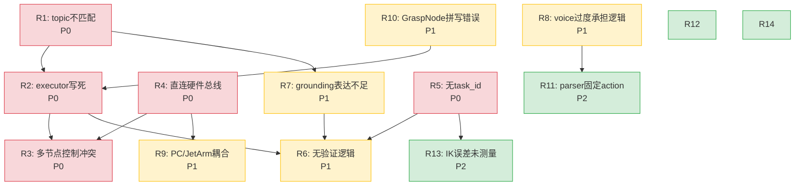

# JetArm Robot Runtime — 风险分析

> 基于 runtime_analysis.md 与 runtime_architecture.md 的系统风险评估
> 按 P0(阻断) / P1(严重) / P2(隐患) 分级
> 分析日期：2026-05-17

---

## 风险矩阵速览

| # | 风险 | 等级 | 影响域 |
|---|------|------|--------|
| R1 | Topic 不匹配：grounding 收不到视觉数据 | P0 | Grounding |
| R2 | executor 动作序列硬编码 | P0 | Skill Runtime / Executor |
| R3 | 6 节点无仲裁同时控制 servo | P0 | Safety / Teleop |
| R4 | executor 绕过 controller_manager 直连硬件总线 | P0 | Safety |
| R5 | 无 task_id / 任务状态机 | P0 | RobotOps / Verification |
| R6 | 无系统化验证逻辑 | P1 | Verification |
| R7 | grounding 对象表达不足 | P1 | Grounding / Skill Runtime |
| R8 | llm_voice_agent 过度承担逻辑 | P1 | Teleop / RobotOps |
| R9 | PC/JetArm 紧耦合 + .so IK 黑盒 | P1 | 全系统 |
| R10 | GraspNode 变量拼写错误 | P1 | Execution |
| R11 | parser action 固定为 "pick" | P2 | Skill Runtime |
| R12 | social_robot SDK 与主系统紧耦合 | P2 | 代码复杂度 |
| R13 | IK 误差链未测量 | P2 | Precision |
| R14 | grounding 模糊匹配 | P2 | Grounding |
| R15 | 原始感知不稳定 | **P0** | Grounding / Verification / Skill Runtime |

---

## P0 风险 — 阻断级（不修复则 Runtime 不可建立）

---

### R1: Topic 不匹配 — grounding 收不到视觉数据

**问题描述**

`grounding_node` 订阅 topic `/world_model/roi_objects`，但 3 个主要世界模型发布方使用的是 `/world_model/objects`：

| 发布方 | 发布 Topic | 数据 |
|--------|-----------|------|
| `app_compatible_yolo_node` | `/world_model/objects` | YOLO 检测 + 世界坐标 |
| `wm_from_tf` | `/world_model/objects` | TF frame → 对象推断 |
| `wm_dummy_pub` | `/world_model/objects` | 仿真测试对象 |
| `roi_color_detector_node` | `/world_model/roi_objects` | ROI 颜色检测 |

> 只有 `roi_color_detector_node` 与 `grounding_node` topic 匹配。YOLO、TF、dummy 数据全部被 `grounding_node` 丢弃。

**影响范围**

- `grounding_node._select_object()` 的 `self.objects` dict 保持为空（除非同时运行 `roi_color_detector_node`）
- 所有用户指令的 from 端（目标物体）无法匹配 → `status: "no_match"`
- `ground_executor_node` 收不到带 `source_pose` 的 goal → 无法执行抓取
- **整个 Grounding → Executor 链路断裂**

**当前症状**

`grounding_node` 日志中 `self.objects` 始终为空 dict `{}`。监控 `/world_model/roi_objects` 无发布方时无任何数据到达。

**根因**

`grounding_node.add_subscription()` 的 topic 名 `/world_model/roi_objects` 与发布方使用的 `/world_model/objects` 不一致。两者是独立的 ROS2 topic，DDS 层面不会自动桥接。

**推荐修复方案**

方案 A（最小改动，Sprint 1 采用）：
```python
# ground_bringup.launch.py 中增加 remap
Node(
    package='grounding', executable='grounding_node',
    remappings=[('/world_model/roi_objects', '/world_model/objects')]
)
```

方案 B（参数化，后续标准化）：
```python
# grounding_node.py 新增参数
self.declare_parameter('world_model_topic', '/world_model/objects')
self.sub_wm = self.create_subscription(String, wm_topic, ...)
```

**对 Teleop / RobotOps / Skill Runtime 的影响**

- **Teleop**: 不直接影响，但 teleop 中的 "看面前" 环境扫描功能依赖 grounding 的正常运作
- **RobotOps**: 当前 grounding 无数据流入，task log 中将缺失 `world_model_snapshot` 字段
- **Skill Runtime**: 若 grounding 无目标输出，所有物体系 skill（pick/place/pour）均不可用

---

### R2: executor 动作序列硬编码

**问题描述**

`ground_executor_node._handle_goal()` 无条件执行固定的 10 步 pick-and-place 序列：

```
hover_source → gripper_open(200) → approach_pick → gripper_close(700) →
lift → hover_target → approach_place → gripper_open(200) → lift → return_home
```

不支持任何其他动作类型、条件分支、部分跳过、动态调整。

硬编码参数：

| 参数 | 硬编码值 | 位置 |
|------|---------|------|
| 夹爪张开 pulse | 200 | `_handle_goal()` 步骤定义 |
| 夹爪闭合 pulse | 700 | `_handle_goal()` 步骤定义 |
| 悬停高度 | 0.08 m | `hover_height` 参数 |
| 接近高度 | 0.015 m | `approach_z` 参数 |
| 提起高度 | 0.08 m | `lift_height` 参数 |
| 回位脉冲 | [500,560,130,115,500] | `home_pulses` 参数 |
| 运动时长 | 2000 ms | `move_duration_ms` 参数 |
| IK fallback | [500,500,500,500,500] | `_ik_get_pulses()` |

**影响范围**

- 用户说 "把杯子推到左边"（push）→ 仍然执行 pick-and-place
- 用户说 "wave" → 仍然执行 pick-and-place
- 用户说 "扫描桌面" → 仍然执行 pick-and-place（如果有 grounded_goal 输入）
- 无法根据环境条件调整策略（如物体太近则先移开，再抓）

**当前症状**

无论 `/parsed_command` 的 `action` 字段是什么，executor 的行为完全相同。它不读取 `data.get('intent')` 做任何分支判断。

**根因**

`_handle_goal()` 仅是一种"数据驱动固定流水线"而非"intent 驱动动作调度"。没有 SkillRegistry，没有意图→动作的映射机制。

**推荐修复方案**

Sprint 1：最小注入 task_id + 执行结果日志（不改变序列）
Sprint 2：引入 SkillManager + SkillRegistry，将各意图映射到独立 Skill；executor 只负责调度

```python
# Sprint 2 目标代码骨架
class GroundExecutorNode:
    def _handle_goal(self, data):
        intent = data.get('intent')
        skill = self.skill_mgr.select(intent)
        result = skill.execute(TaskContext.from_goal(data))
        self._publish_result(result)
```

**对 Teleop / RobotOps / Skill Runtime 的影响**

- **Skill Runtime**: 当前根本不存在，此问题正是引入 Skill Runtime 的核心动机
- **Teleop**: 遥控操作不经过 executor，但若 teleop 想触发自动动作则无法复用
- **RobotOps**: task log 中所有任务看起来完全相同（都是 pick-and-place），无法区分

---

### R3: 6 节点无仲裁同时控制 servo

**问题描述**

所有以下节点均可独立向 `/servo_controller` topic 发布 `ServosPosition` 消息，无任何控制权协调：

| 节点 | 发布条件 | 频率 |
|------|----------|------|
| `ground_executor_node` | 自动任务执行中 | 任务触发时 |
| `face_follow_node` | 人脸跟踪激活中 | 持续（每帧指令） |
| `grasp` (GraspNode) | 收到 `/grasp` 消息 | 消息触发 |
| `env_scan_node` | 环境扫描中 | 扫描时 |
| `gesture_player_node` | nod/shake 手势 | 手势触发 |
| `llm_voice_agent` | 唤醒手势 | 唤醒时 |

每个节点独立决定何时发送命令。若 `face_follow_node` 正在执行人脸跟踪时 `ground_executor_node` 触发了 pick 任务，两个节点会向同一机械臂交错下发舵机脉冲，导致不可预测的运动行为。

**影响范围**

- 机械臂可能突然抖动
- 自动任务被人脸跟踪打断
- 夹爪可能在运动中意外张开/闭合
- 最坏情况：碰撞、物体掉落、机械臂过载

**当前症状**

目前可能在以下场景复现：启动 `face_follow.launch.py` + 执行语音抓取指令时，机械臂动作不连贯、抖动。

**根因**

没有控制权仲裁机制。每个节点直接写 `/servo_controller`，ROS2 topic 本身不提供互斥语义。

**推荐修复方案**

Sprint 1：暂不引入仲裁，但记录所有节点对 servo_controller 的发布（用于监控）
Sprint 2：新建 `control_arbiter_node`

```python
# control_arbiter_node 核心逻辑
class ControlArbiterNode(Node):
    CONTROL_STATES = ["AUTO", "MANUAL", "PAUSED", "ESTOP"]
    # 通过 /control/request + /control/ack 实现互斥
    # 手动模式 → 自动任务被阻塞
    # ESTOP → 所有控制被阻塞
```

**短期缓解**：在 launch 中互斥启动 face_follow 和 executor（不能同时运行）

**对 Teleop / RobotOps / Skill Runtime 的影响**

- **Teleop**: 这是引入 Teleop 的先决条件。不解决则 Manual 模式无法安全接管 Auto 模式
- **RobotOps**: 仲裁日志（谁在何时获得/放弃控制权）是 RobotOps 的核心数据
- **Skill Runtime**: Skill 执行前必须申请控制权

---

### R4: executor 绕过 controller_manager 直连硬件总线

**问题描述**

`ground_executor_node` 直接将 `ServosPosition` 消息发布到 `/ros_robot_controller/bus_servo/set_position`，这是硬件驱动的最底层 topic，完全绕过了 `servo_controller/controller_manager`。

正常路径应为：
```
executor → /servo_controller → controller_manager → ServoManager → bus_servo/set_position
```

`controller_manager` 在正常路径中提供：
- `JointPositionController` 的限位保护（`min_angle`/`max_angle`）
- 脉冲钳位（[0, 1000]）
- 时长钳位（[0.02, 30]s）
- 弧度/角度 → 脉冲转换

绕过这些保护后，理论上可以通过 executor 向机械臂发送任何 pulse 值，包括超出物理限位的危险值。

**影响范围**

- 机械臂可能被命令到物理极限位置
- 夹爪可能被过度闭合（电流过大）
- 如果 IK 计算错误产生非法 pulse，硬件直接执行

**当前症状**

即使在 `controller_manager` 的 YAML 配置中定义了 joint 限位（如 min: 0, max: 1000），executor 也能发送超出范围的值。

**根因**

`ground_executor_node._publish_servos()` 直接创建 `ros_robot_controller_msgs/ServosPosition` 并发布到硬件总线 topic，不使用 `servo_controller_msgs/ServosPosition` 的 `position_unit` 字段和 controller_manager 的转换/钳位。

**推荐修复方案**

Sprint 1：在 `ground_bringup.launch.py` 中 remap executor 的 servo topic 到 `/servo_controller`：
```python
Node(
    package='llm_executor', executable='executor_node',
    remappings=[('/ros_robot_controller/bus_servo/set_position', '/servo_controller')]
)
```

Sprint 2：引入 `servo_adapter` 层，所有 Runtime 代码只通过 adapter 调用硬件

**对 Teleop / RobotOps / Skill Runtime 的影响**

- **Teleop**: 遥控命令同样需要经过 controller_manager 限位保护
- **Skill Runtime**: Skill 不应感知硬件总线 topic，必须通过 adapter
- **RobotOps**: 记录发送的 pulse 值和限位检查结果

---

### R5: 无 task_id / 任务状态机

**问题描述**

`ground_executor_node` 中唯一的"状态"管理是两个布尔变量和一个哈希：

```python
self._busy = True             # 新 goal 直接丢弃，无排队
self._last_goal_hash          # JSON sorted hash 去重 + 800ms throttle
```

缺失：
- `task_id` 生成（UUID/时间戳）
- 任务状态枚举（PENDING → EXECUTING → DONE / FAILED / CANCELLED）
- 任务队列（busy 时不排队，直接丢弃）
- 取消/中断机制
- 执行结果结构化返回

**影响范围**

- 外部系统无法知道"当前在执行什么"
- 任务失败无法追溯
- 无法实现 retry
- `executor_done_sayer` 无法按 task_id 关联播报

**当前症状**

除了 ROS2 日志行 `[done] 执行完成`，无任何方式查询任务状态。两个快速连续的指令第二个被静默丢弃。

**根因**

设计时未引入 TaskContext 概念。executor 仅视为"收到 goal → 执行 → 结束"的纯函数。

**推荐修复方案**

Sprint 1：新建 `runtime_state_node`，为每个 `/parsed_command` 和 `/grounded_goal` 生成 task_id，发布 `/runtime/state` 和 `/runtime/log`

```python
class RuntimeStateNode(Node):
    def _task_id(self):
        return f"task_{uuid.uuid4().hex[:12]}_{int(time.time())}"
    
    STATES = ["parsed", "grounded", "executing", "done", "failed", "cancelled"]
```

Sprint 2：executor 内部使用 TaskContext 对象，支持队列和取消

**对 Teleop / RobotOps / Skill Runtime 的影响**

- **RobotOps**: 没有 task_id，日志无法按任务分组聚合
- **Verification**: 验证结果无法关联到具体 task
- **Skill Runtime**: 每个 skill 需要 task_id 来追踪执行状态
- **Teleop**: 仲裁节点需要知道"当前是否有自动任务在执行"

---

## P1 风险 — 严重（影响系统可信度与可扩展性）

---

### R6: 无系统化验证逻辑

**问题描述**

当前仅有一段可选的视觉确认代码 `_vision_confirm()`（需 `require_vision=True`），且只检查目标类别，不验证动作效果。

缺失的验证：
- 抓取前：目标是否真的存在
- 抓取后：目标是否从原位置消失（是否成功）
- 放置后：目标是否出现在目标区域（放置是否成功）
- 夹爪状态：ID10 是否闭合/张开到预期位置
- 舵机状态：各关节是否到达目标位置
- 超时检测：任务是否超过合理时间
- 碰撞检测：任务中是否有异常力矩/电流

**影响范围**

- 系统执行动作后无法知道是否成功
- 如果抓取失败，会继续执行"lift + place"的后续步骤（在空气中操作）
- 如果放置失败，目标物体可能掉落或放错位置

**当前症状**

执行完成后只输出 `[done] 执行完成`，不包含任何关于"是否实际抓到/放好"的信息。

**根因**

executor 的职责仅定义为"发送 servo 命令"，而非"闭环达成目标"。没有任务验证层。

**推荐修复方案**

Sprint 4：引入 `verification_node`

```python
class VerificationNode:
    def verify_pick(self, ctx: TaskContext) -> VerificationResult:
        # 1. 抓取前查询 /vision_target 确认目标存在
        # 2. 抓取后再次查询确认目标消失
        # 3. 查询 /controller_manager/joint_states 确认 servo 到位
        # 4. 检查 gripper pulse (ID10) 是否在预期范围
        # 5. 检查执行时间是否超时
        # 返回: {success, confidence, reason, evidence}
```

**对 Teleop / RobotOps / Skill Runtime 的影响**

- **Skill Runtime**: Skill 执行完成后需要 verification 反馈来决策 retry
- **RobotOps**: 验证结果是 task log 中最重要的字段之一
- **Teleop**: 不直接相关

---

### R7: grounding 对象表达不足

**问题描述**

grounding 的输出 `/grounded_goal` 用通用 JSON 携带对象信息，字段定义随发布方不同存在差异：

| 来源 | 特有字段 |
|------|----------|
| `wm_dummy_pub` | `class_name`, `color`, `pose`, `confidence`, `updated_at` |
| `wm_from_tf` | 同上（从 TF frame ID 推断 class/color） |
| `vision_yolo` | YOLO `class_name`, `confidence`, `pose`(固定rpy=[0,0,1.57]) |
| `roi_color_detector` | 含 `angle_deg`（方块朝向） |

grounding 的 `_select_object()` 匹配逻辑过于简单：
- `cls in obj["class_name"] or obj["class_name"] in cls`（子串匹配）
- 空 cls 时匹配所有对象（取最近更新的）

问题：
- 无 `source` 字段标记数据来源
- 无 object 追踪历史（同一物体前后帧是否同一 ID？）
- 无法表达空间关系（"杯子左边的方块"）
- 无法表达对象状态（"正在移动的球"）

**影响范围**

- Skill 收到的 `source_pose` 可能来自不可信来源
- 无法区分 YOLO 检测结果和 dummy 数据
- 复杂指令（如"拿最左边的杯子"）无法在 grounding 层处理

**当前症状**

`source_pose` 总是使用 `frame` + `xyz` + `rpy` 三元组，但没有携带来源标记。

**根因**

所有世界模型发布方输出通用 JSON 而非统一的消息类型。grounding 层被动消费所有来源，不做来源标记。

**推荐修复方案**

Sprint 1：引入 `TargetObject.msg`（扩展 `vision_interfaces`）：
```
task_id, name, class_name, color, confidence, center_x/y/z,
world_x/y/z, source, timestamp
```

Sprint 2：grounding 在 `/grounded_goal` 中增加 `source` 字段

**对 Teleop / RobotOps / Skill Runtime 的影响**

- **Skill Runtime**: Skill 需要知道目标位姿的可信度来决定接近策略
- **RobotOps**: 记录视觉检测来源是复盘的关键信息

---

### R8: llm_voice_agent 过度承担逻辑

**问题描述**

`llm_voice_agent` 本身就是语音入口节点，但它的 `_on_query()` 处理方法同时承担了：

1. ASR 结果处理
2. 唤醒词管理
3. 系统三层状态机（L1 pause/resume, L2 wake/sleep, L3 mute/unmute）
4. 模式管理（chat/task）
5. **槽位提取**（COLOR_MAP + CLASS_MAP + SIDE_MAP）
6. **确认对话**（confirm/cancel）
7. 社交控制（发布 `/gesture/cmd`, `/face_follow/control`）
8. LLM 推理（Ollama HTTP API）
9. 任务指令发布（发布 `/keyboard_input/input` 进入 parser 链路）

voice_agent 实际上替代了部分 parser 和 executor 的职责。

**影响范围**

- 语音系统与任务调度紧耦合 → 语音重构时可能打断任务执行链路
- 如果没有语音输入（仅键盘），槽位提取等多段逻辑不可用
- Roadmap P5（语音重构）的实现将被迫同时重构任务调度

**当前症状**

查看 `_on_query()` 方法，约 200 行包含 L1/L2/L3 状态检查、chat/task 分支、槽位提取、confirm 循环、LLM API 调用、gesture 触发等互不相关的逻辑。

**根因**

voice_agent 被设计为"全功能机器人主脑"，而非单一职责的"语音输入适配器"。

**推荐修复方案**

Sprint 2（与 voice P5 同步）：
- voice_agent 只负责：ASR → clean text → 发布 `/input_text`
- 槽位提取移到 `llm_parser`
- 确认逻辑移到 `task_manager`
- 社交控制移到独立 behavior node

**对 Teleop / RobotOps / Skill Runtime 的影响**

- **Teleop**: `llm_voice_agent` 的 L1 pause/resume 实际上扮演了部分控制权管理角色，与未来的 arbiter 冲突
- **RobotOps**: voice_agent 内部的语音对话状态不可被 RobotOps 日志捕获
- **Skill Runtime**: 当前 voice_agent 中的槽位提取逻辑应该属于 Skill 选择的前置步骤

---

### R9: PC/JetArm 紧耦合 + .so IK 黑盒

**问题描述**

当前架构存在双层紧耦合：

**层1 — 网络服务耦合**：
- PC 侧的 `ground_executor_node` 直接调用 JetArm 侧的 `/kinematics/set_pose_target` 服务
- PC 侧的 `app_compatible_yolo_node` 直接调用 JetArm 侧的 `/kinematics/get_current_pose` 服务
- 如果 JetArm 侧 IK 服务不可用 → executor 退化为 `[500,500,500,500,500]` fallback
- 如果网络中断 → 整个执行链路断裂

**层2 — IK .so 黑盒**：
- IK 求解器封装在 JetArm 原厂编译好的 `.so` 中
- 无源码 → 无法排查 IK 求解失败原因
- `pitch_range`、`resolution` 参数含义无文档
- 无法修改/优化求解算法
- 无法在 PC 侧做 IK 验证（必须在 JetArm 上调用后再返回 PC）

**影响范围**

- 任何 IK 相关 bug 都只能观察输入输出，无法内部调试
- IK 服务不可用时 executor 发 `[500,500,500,500,500]` 到硬件，可能无效甚至危险
- 网络延迟使 executor 的 `_wait_motion_and_settle()` 逻辑不稳定

**当前症状**

`_ik_get_pulses()` 中的 fallback `return [500, 500, 500, 500, 500]` 在所有 IK 失败情况下返回相同值，无论目标位姿在哪里。

**根因**

原厂 JetArm 将 IK 封装为不可见的 `.so`，PC 侧只能通过 ROS2 service 调用。

**推荐修复方案**

保持当前策略：继续使用原厂 IK。但做以下增强：

Sprint 1：
- IK 调用失败时记录详细日志（目标位姿 + 参数 + 错误）
- 不返回 `[500,500,500,500,500]` 而是抛出异常让 executor 进入 `failed` 状态

Sprint 4（P4 IK 精度优化）：
- 记录 IK 输入（position, pitch, pitch_range, resolution）和输出（pulse[]）到日志
- 分析 IK 失败模式，排查是参数问题还是求解器问题

**对 Teleop / RobotOps / Skill Runtime 的影响**

- **Teleop**: 遥控通常用速度/位置控制，不经过 IK service
- **RobotOps**: 每次 IK 调用都应记录输入/输出，用于精度分析（P4）
- **Skill Runtime**: Skill 通过 adapter 调用 IK，adapter 负责处理 IK 异常

---

### R10: GraspNode 变量拼写错误

**问题描述**

`servo_controller/grasp.py` 的 `GraspNode.set_target()` 方法中存在变量名拼写错误：

```python
# 定义时
self.target1 = res.pulse      # ✅ 正确
self.targe2 = res.pulse        # ❌ 应为 self.target2
self.targe3 = res.pulse        # ❌ 应为 self.target3

# 使用时
servo_data = self.target2[1]   # ❌ AttributeError: no attribute 'target2'
```

`move_toward()`、`move_target()`、`move_retreat()`、`gripper_align()` 均引用 `self.target2` 和 `self.target3`，但 set_target 中定义的变量名为 `self.targe2` 和 `self.targe3`。

**影响范围**

`grasp` (GraspNode) 在收到 `/grasp` 消息后，执行 pick/place 序列时会在第 1-2 步崩溃。

**当前症状**

Service 端日志会显示 `AttributeError: 'GraspNode' object has no attribute 'target2'`。

**根因**

代码拼写错误，`target` 写成了 `targe`。未经过充分测试。

**推荐修复方案**

修改变量名字符串：
```python
# grasp.py line ~50-60
self.target2 = res.pulse   # 原 self.targe2
self.target3 = res.pulse   # 原 self.targe3
```

但当前阶段不应修改 `servo_controller` 包（按 OPEN_CODE_RULES 规则）。待 Sprint 2 引入 Skill Runtime 后，此节点将被替代。

**对 Teleop / RobotOps / Skill Runtime 的影响**

- **Skill Runtime**: Sprint 2 引入的新 skill 系统将替代此 GraspNode，不再依赖它
- **RobotOps**: 此节点的崩溃应被记录为已知 vendor bug

---

## P2 风险 — 隐患（影响长期可维护性与精度）

---

### R11: parser action 固定为 "pick"

**问题描述**

`llm_parser.parse()` 方法中 `action` 字段始终硬编码为 `"pick"`：

```python
# llm_command_parser_node.py:37
act = "pick"
```

无论用户输入什么，parsed command 的 action 始终为 `"pick"`。

**影响范围**

- "放杯子" → action="pick"
- "移动方块" → action="pick"
- "推一下" → action="pick"
- grounding 和 executor 收到的 intent 始终为 "pick"

**当前症状**

所有用户指令产生相同 action。executor 的硬编码行为恰好掩盖了此问题（反正 executor 也只做 pick-and-place）。

**根因**

parser 设计时仅考虑单一用例（抓取），未扩展意图识别。

**推荐修复方案**

Sprint 1：将 `INTENT_VERBS` 映射（已存在于 `llm_voice_agent:161` 但未使用）引入 parser：
```python
INTENT_VERBS = {
    '拿': 'pick', '取': 'pick', '抓': 'pick', '抓取': 'pick',
    '放': 'place', '放到': 'place',
    '移动': 'move', '搬': 'move', '移': 'move',
}
```

**对 Teleop / RobotOps / Skill Runtime 的影响**

- **Skill Runtime**: 多 intent 支持是 Skill 调度的前置条件
- **RobotOps**: 记录真实的 intent 而非固定 "pick"

---

### R12: social_robot SDK 与主系统紧耦合

**问题描述**

`social_robot` 包引入了约 13 个 SDK 依赖文件（`sdk/buzzer.py`, `sdk/pid.py`, `sdk/common.py`(366行), `sdk/tone.py`, `sdk/check_servo_connection.py`, `include/face_mesh.py`, `include/mankind_pose.py`, `include/finger_trajectory.py`, `include/face_tracking.py` 等），但目前实际使用的仅有 `face_follow_node`, `gesture_player_node`, `env_scan_node`, `static_env_report_node`。

其余文件（FingerTrajectory, BuzzerController, MankindPose, FaceMesh, PID, ToneGenerator 等）引入但未激活，增加了包复杂度。

**影响范围**

- 包依赖列表臃肿
- 不清晰的模块边界
- 构建时引入不必要的 Python 依赖

**当前症状**

`sdk/fps.py`, `sdk/tone.py`, `sdk/pid.py`, `sdk/buzzer.py`, `include/finger_trajectory.py`, `include/mankind_pose.py` 等文件存在但未被主 launch 文件引用或未在 entry_points 中注册。

**根因**

`sdk/` 目录来自 JetArm 原厂参考实现，作为整体拷贝到 social_robot 包中，未做裁剪。

**推荐修复方案**

Sprint 2+：将 social_robot 包拆分为：
- `face_tracking`（仅 face_follow + gesture_player）
- `env_scanner`（env_scan + static_env_report + world_model）
- 删除未使用的 SDK 文件

**对 Teleop / RobotOps / Skill Runtime 的影响**

- 无直接功能影响，纯架构清理

---

### R13: IK 误差链未测量

**问题描述**

机械臂抓不准的来源是复合误差链，但当前系统未做任何量化测量：

```
相机标定误差 → 深度噪声 → 目标中心点偏差 → gripper_tip 偏移未补偿
→ 抓取高度不合理 → 末端姿态 pitch 不适合 → IK 解算误差 → 舵机执行误差
```

每次抓取记录为 `target_pose` + `ik_result`，但：
- 未记录实际到达位姿（`/controller_manager/joint_states` 可用于逆推）
- 未记录最终是否成功抓取

**影响范围**

- Roadmap P4（抓取精度优化）缺乏数据基础
- 无法区分视觉误差、IK 误差、执行误差
- 重复抓取误差不可测量

**当前症状**

抓取成功率没有量化统计。只知道"有时抓得到有时抓不到"。

**根因**

设计时未预置测量点。IK 服务是黑盒，视觉输出坐标没有与 IK 输入对齐的可视化反馈。

**推荐修复方案**

Sprint 2 (RobotOps) + Sprint 4 (IK 精度)：
- 每次抓取记录完整的 `(视觉坐标, IK输入, IK输出pulse, 实际joint_state, 视觉确认结果)`
- 在 logs 中累积数据，用于偏差分析

**对 Teleop / RobotOps / Skill Runtime 的影响**

- **RobotOps**: 核心数据需求
- **Skill Runtime**: 精度分析结果可用于调整 skill 参数（如 hover_height 补偿值）

---

### R14: grounding 模糊匹配

**问题描述**

`grounding_node._select_object()` 的 `ok_cls` 判定逻辑为子串匹配：

```python
ok_cls = True if not cls else (
    o["class_name"] == cls        # 精确匹配
    or cls in o["class_name"]     # cls 是 class_name 的子串
    or o["class_name"] in cls     # class_name 是 cls 的子串
)
```

潜在问题：
- `cls=""` 或 `cls=None` → `not cls` = True → 匹配所有对象（取最近更新的）
- `cls="a"` → 匹配 `"ball"`, `"cup"`, `"banana"` 等包含 "a" 的所有对象
- `cls="cup"` → 匹配 `"cup"`, `"cupcake"` 等

**影响范围**

在场景中有多个不同类别物体时，可能匹配到错误的物体。尤其是颜色识别失败时（`color=None` 且 `cls=None`），会随机选择一个对象。

**当前症状**

在 R1（topic 不匹配）修复后，如果场景中有多个对象且用户未指定颜色，可能错误抓取。

**根因**

子串匹配过于宽松。应当使用精确匹配 + 近似匹配（Levenshtein/edit distance）。

**推荐修复方案**

```python
def _select_object(self, cls, color):
    candidates = []
    for o in self.objects.values():
        if cls and not (o["class_name"] == cls):
            continue  # 精确匹配
        if color and not (o["color"] == color):
            continue  # 精确匹配
        candidates.append(o)
    # 按 confidence ↓, recency ↓, proximity ↑ 排序
```

**对 Teleop / RobotOps / Skill Runtime 的影响**

- **Skill Runtime**: 抓取错误目标 → 后续放置位置可能错误 → 验证失败 → retry 会扩大问题
- **RobotOps**: 日志中记录的 object_id 可能指向错误的物体

---

## 风险依赖关系图



---

## Sprint 覆盖矩阵

| 风险 | Sprint 1 | Sprint 2 | Sprint 3 | Sprint 4 |
|------|----------|----------|----------|----------|
| R1: topic 不匹配 | ✅ FIX | — | — | — |
| R2: executor 写死 | 🔶 注入task_id | ✅ SkillManager | — | — |
| R3: 多节点控制冲突 | 🔶 记录监控 | ✅ ArbiterNode | — | — |
| R4: 直连硬件总线 | ✅ remap topic | ✅ servo_adapter | — | — |
| R5: 无 task_id | ✅ runtime_state_node | ✅ TaskContext | — | — |
| R6: 无验证逻辑 | — | — | — | ✅ verification_node |
| R7: grounding 表达不足 | ✅ TargetObject.msg | ✅ source 字段 | — | — |
| R8: voice 过度承担 | — | ✅ 逻辑分离 | — | — |
| R9: PC/JetArm 耦合 | 🔶 IK 异常日志 | — | — | ✅ 精度分析 |
| R10: GraspNode 拼写 | — | ✅ skill 替代 | — | — |
| R11: parser 固定 action | ✅ 意图映射 | ✅ LLM parser | — | — |
| R12: social_robot 冗余 | — | ✅ 拆分 | — | — |
| R13: IK 误差链 | — | — | ✅ log 记录 | ✅ 偏差分析 |
| R14: grounding 模糊匹配 | — | ✅ 精确匹配 | — | — |
| R15: 原始感知不稳定 | — | ✅ StableObjectTracker | ✅ stable_objects | ✅ 稳定世界模型 |

> ✅ = 修复 | 🔶 = 部分缓解 | — = 不涉及

---

### R15: 原始感知不稳定 / 不稳定世界模型

**问题描述**

`roi_color_detector_node` 的 debug overlay 显示：同一物理物体在不同帧之间的 class/color 发生跳变：
- Frame 1: `cup red`
- Frame 2: `cup black`
- Frame 3: `cylinder red`

这是 LAB 颜色空间分类、光照变化、轮廓形状判断的综合结果。当前 `/world_model/roi_objects` 是**逐帧原始检测流**，不包含任何时间平滑。

**影响范围**

- **Grounding**: 物体 class/color 可能在某帧匹配失败 → `_select_object()` 返回 `None` → `status: no_match`
- **Skill 执行**: 如果 grounding 由于不稳定检测而选错物体，PickSkill 会抓取错误的目标
- **Verification**: 抓取前后检测同一物体，由于 class 不同被判定为"不同物体" → 误报 `target_not_removed`
- **Retry**: 不稳定世界模型导致重试无意义（每次决策基础都不可信）
- **RobotOps**: 日志中记录的 `target_object` 可能不是实际抓取的物体

**当前症状**

ROI debug window 观察: 同一静止物体在 30fps 流中 label 在 2-3 种 class/color 组合之间快速切换。confidence 在 0.5-0.9 之间抖动。

**根因**

LAB 阈值受光照影响；类名判断依赖 circularity / right_angle_count / aspect_ratio 等几何特征，这些特征在遮挡或角度变化时不稳定；无时间平滑。

**推荐修复方案**

Sprint 5 引入 StableObjectTracker：

1. 每帧接收 RAW detections → 与已知 tracks 进行 IoU/距离匹配
2. 同一 track 的 class/color 做 Temporal Voting（最近 10 帧多数投票）
3. confidence 做 EMA 平滑（α=0.3）
4. 连续 N 帧未检测到 → TTL 超时移除
5. 输出 `/world_model/stable_objects` topic
6. grounding_node 可切换使用 stable_objects

**对 Teleop / RobotOps / Skill Runtime / Verification 的影响**

- **Verification**: 这是一个阻断项 — Verification Runtime 不能建立在不稳定世界模型上
- **Skill Runtime**: 不影响执行链路，但抓取成功率受 unstable grounding 影响
- **RobotOps**: 日志中需要记录 RAW 和 STABLE 两个版本用于审计

**优先级**: HIGH — 阻塞 Sprint 6 Verification Runtime


---

### R16: Perception Source Mismatch / Fusion Ambiguity

**问题描述**

YOLO 和 ROI 是两类独立检测源：
- YOLO: 语义类名稳定，无颜色，位姿依赖 IK 查询
- ROI: 位姿/颜色可靠，类名分类不稳定

融合时存在以下歧义：
- 两个物理上分离但 ROI 都检测到的物体，YOLO 只检测到一个 → 哪个 ROI 与 YOLO 匹配？
- YOLO 类名 ("cup") 与 ROI 类名 ("cylinder") 冲突 → fusion 取 YOLO，但 roi_only 仍输出 "cylinder"
- ROI 输出 `"cube black"` 可能比 YOLO 的 "bottle" 更准确（对红色方块）
- ROI 颜色 (`"red"` vs `"black"`) 仍会跨帧跳变，LAB 阈值重叠导致误分类

**当前缓解**

| 措施 | 状态 |
|------|------|
| YOLO 语义优先 | ✅ 已实现 — fusion 规则固定 YOLO class_name |
| ROI 位姿优先 | ✅ 已实现 — fusion 输出使用 ROI pose.xyz/rpy |
| ROI-only 保留 | ✅ 已实现 — 未被匹配的 ROI 对象保留 source=roi_only |
| yolo_class / roi_class 字段 | ✅ 已实现 — 下游可验证原始来源 |
| StableObjectTracker after fusion | ✅ 准备就绪 — 时序投票消除残留不稳定 |
| ROI 颜色/类名根本性修复 | ⏸ 延后 — Sprint 5.3 DEFERRED |
| 置信度过滤 roi_only | ⏸ 延后 — ROI confidence 源自 contour circularity, 不可靠阈值 |

**影响范围**

- **Skill Runtime**: 抓取目标从 fusion 输出获取，class_name 可信度 > 纯 ROI
- **Verification**: 验证逻辑对比抓取前后 world_model 状态，fusion source 字段可帮助判断可信度
- **RobotOps**: 日志需同时记录 yolo_class 和 roi_class 用于审计

**优先级**: P1 — 当前 fusion 规则已缓解，下游 StableObjectTracker 进一步降噪
