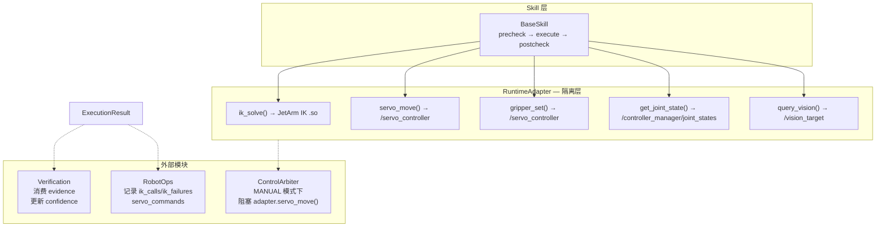

# Robot Runtime v0.1 — Skill Interface

> 设计目标：将硬编码动作序列改造为可注册、可替换、可组合的 Skill 系统
> 关联：`runtime_task_schema.md`、`runtime_target_object.md`

---

## 1. 设计理念

当前 `ground_executor_node._handle_goal()` 中硬编码了 10 步 pick-and-place 序列。
Skill 系统的核心原则：

1. **Skill 不直连硬件**：通过 `RuntimeAdapter` 调用 IK / servo，永远不直接操作 `/ros_robot_controller/bus_servo/set_position`
2. **统一返回**：每个 Skill 返回 `ExecutionResult`，Executor 据此决策
3. **可注册**：`SkillRegistry` 支持静态注册 + 未来动态加载
4. **参数可覆盖**：`skill_params` 允许不同任务使用不同参数（抓取高度、夹爪力度等）
5. **不改底层**：不修改 `servo_controller` / `kinematics` / `ros_robot_controller`

---

## 2. ExecutionResult 数据结构

```python
# sketch_runtime/execution_result.py
from dataclasses import dataclass, field
from typing import Optional, Dict, Any
import time

@dataclass
class ExecutionResult:
    task_id: str                              # 关联的 TaskContext.task_id
    success: bool                             # 是否成功
    reason: str = ""                          # "pick_completed" | "ik_failed" | "timeout" | "cancelled"
    confidence: float = 0.0                   # 0.0 ~ 1.0, 可被 Verification 节点更新

    # 证据链 — Verification 节点可直接消费
    evidence: Dict[str, Any] = field(default_factory=dict)
    # 例: {
    #   "gripper_closed": true,
    #   "servo_positions_reached": true,
    #   "execution_duration_ms": 8200,
    #   "ik_calls": 3, "ik_failures": 0,
    #   "steps_completed": 5, "steps_total": 7,
    #   "last_step": "gripper_close_pick"
    # }

    error_detail: Optional[str] = None        # 失败时的详细错误信息
    timestamp: float = field(default_factory=time.time)

    def to_dict(self) -> dict:
        return {
            "task_id": self.task_id,
            "success": self.success,
            "reason": self.reason,
            "confidence": round(self.confidence, 3),
            "evidence": self.evidence,
            "error_detail": self.error_detail,
            "timestamp": self.timestamp
        }
```

---

## 3. BaseSkill 抽象接口

```python
# sketch_runtime/base_skill.py
from abc import ABC, abstractmethod
from typing import Optional
from sketch_runtime.task_context import TaskContext
from sketch_runtime.execution_result import ExecutionResult

class BaseSkill(ABC):
    """
    Skill 基类。子类必须实现 execute()。

    生命周期:
      precheck() → execute() → postcheck() → cleanup()

    执行顺序:
      1. precheck()   — 返回 None 则继续, 返回 ExecutionResult 则阻断
      2. execute()    — 核心逻辑, 必须返回 ExecutionResult
      3. postcheck()  — 执行后验证, 默认透传 execute() 结果
      4. cleanup()    — 无论成功/失败/取消都调用
    """

    name: str = "base_skill"  # 子类必须重写

    def __init__(self, adapter):
        """
        Args:
            adapter: RuntimeAdapter 实例
                     Skill 只能通过 adapter 调用:
                     - adapter.ik_solve(...) → pulses
                     - adapter.servo_move(pulses, duration_ms)
                     - adapter.gripper_set(servo_id, pulse, duration_ms)
                     - adapter.get_joint_state() → JointState
                     - adapter.query_vision(class_name) → DetectionResult or None
        """
        self.adapter = adapter

    # ──── 可选重写的方法 ────

    def precheck(self, ctx: TaskContext) -> Optional[ExecutionResult]:
        """
        执行前检查。返回 None = 通过；返回 ExecutionResult = 阻断。

        默认实现：检查 target_object 是否存在。
        """
        obj = ctx.target_object
        if not obj:
            return ExecutionResult(
                task_id=ctx.task_id, success=False,
                reason="no_target_object",
                error_detail="TaskContext.target_object is None"
            )
        return None

    @abstractmethod
    async def execute(self, ctx: TaskContext) -> ExecutionResult:
        """核心执行逻辑。子类必须实现。"""
        ...

    def postcheck(self, ctx: TaskContext, result: ExecutionResult) -> ExecutionResult:
        """
        执行后验证。默认透传 execute() 的结果。

        子类可重写以添加验证逻辑。
        """
        return result

    def cleanup(self, ctx: TaskContext):
        """资源清理。默认无操作。"""
        pass

    # ──── 工具方法 ────

    def _log_step(self, ctx: TaskContext, step_name: str):
        """使用 adapter 的统一日志记录每个步骤"""
        if hasattr(self.adapter, '_node'):
            self.adapter._node.get_logger().info(
                f"[{ctx.task_id}] Skill.{self.name} → {step_name}"
            )
```

---

## 4. PickSkill 完整实现示例

```python
# sketch_runtime/skills/pick_skill.py
from sketch_runtime.base_skill import BaseSkill
from sketch_runtime.task_context import TaskContext
from sketch_runtime.execution_result import ExecutionResult

class PickSkill(BaseSkill):
    name = "pick_skill"

    # ── 默认参数（可被 ctx.skill_params 覆盖） ──
    DEFAULTS = {
        "hover_height": 0.08,
        "approach_z": 0.015,
        "lift_height": 0.08,
        "grip_open_pulse": 200,
        "grip_close_pulse": 700,
        "move_duration_ms": 2000,
        "gripper_id": 10,
        "ik_pitch_deg": 80.0,
        "ik_pitch_range": [-180.0, 180.0],
        "ik_resolution": 1.0,
    }

    def _param(self, ctx: TaskContext, key: str):
        return ctx.skill_params.get(key, self.DEFAULTS.get(key))

    def precheck(self, ctx: TaskContext):
        obj = ctx.target_object
        if not obj or not obj.get("pose"):
            return ExecutionResult(
                task_id=ctx.task_id, success=False,
                reason="no_target_object",
                error_detail="Missing target_object or pose in task context"
            )
        return None

    async def execute(self, ctx: TaskContext):
        src = ctx.target_object.get("pose", {})
        s_xyz = list(map(float, src.get("xyz", [0, 0, 0])))
        s_rpy = list(map(float, src.get("rpy", [0, 0, 0])))
        tgt = ctx.target_pose or {}

        hover_h   = self._param(ctx, "hover_height")
        approach_z = self._param(ctx, "approach_z")
        lift_h    = self._param(ctx, "lift_height")
        grip_open  = self._param(ctx, "grip_open_pulse")
        grip_close = self._param(ctx, "grip_close_pulse")
        gripper_id = self._param(ctx, "gripper_id")
        move_dur   = self._param(ctx, "move_duration_ms")

        ev = {"ik_calls": 0, "ik_failures": 0, "steps_completed": 0, "steps_total": 5}

        try:
            # 1) 悬停到源上方
            pulses = await self.adapter.ik_solve(
                [s_xyz[0], s_xyz[1], s_xyz[2] + hover_h], s_rpy)
            ev["ik_calls"] += 1
            if pulses is None:
                ev["ik_failures"] += 1
                return ExecutionResult(ctx.task_id, success=False,
                    reason="ik_failed_hover", evidence=ev)
            await self.adapter.servo_move(pulses, move_dur)
            ev["steps_completed"] += 1
            self._log_step(ctx, "hover_source")

            # 2) 张开夹爪
            await self.adapter.gripper_set(gripper_id, grip_open, 300)
            ev["steps_completed"] += 1
            self._log_step(ctx, "gripper_open")

            # 3) 下降到抓取位
            pulses = await self.adapter.ik_solve(
                [s_xyz[0], s_xyz[1], approach_z], s_rpy)
            ev["ik_calls"] += 1
            if pulses is None:
                ev["ik_failures"] += 1
                return ExecutionResult(ctx.task_id, success=False,
                    reason="ik_failed_approach", evidence=ev,
                    error_detail="Cannot reach approach position")
            await self.adapter.servo_move(pulses, move_dur)
            ev["steps_completed"] += 1
            self._log_step(ctx, "approach_pick")

            # 4) 闭合夹爪
            await self.adapter.gripper_set(gripper_id, grip_close, 300)
            ev["steps_completed"] += 1
            self._log_step(ctx, "gripper_close")

            # 5) 提起
            pulses = await self.adapter.ik_solve(
                [s_xyz[0], s_xyz[1], s_xyz[2] + lift_h], s_rpy)
            ev["ik_calls"] += 1
            if pulses is None:
                ev["ik_failures"] += 1
                return ExecutionResult(ctx.task_id, success=False,
                    reason="ik_failed_lift", evidence=ev,
                    error_detail="Pick succeeded but lift failed, object may be dropped")
            await self.adapter.servo_move(pulses, move_dur)
            ev["steps_completed"] += 1
            self._log_step(ctx, "lift_after_pick")

            return ExecutionResult(ctx.task_id, success=True,
                reason="pick_completed", confidence=0.95, evidence=ev)

        except Exception as e:
            return ExecutionResult(ctx.task_id, success=False,
                reason="exception", error_detail=str(e), evidence=ev)
```

---

## 5. SkillRegistry 与 SkillManager

```python
# sketch_runtime/skill_registry.py
from typing import Dict, Type, List
from sketch_runtime.base_skill import BaseSkill

class SkillRegistry:
    """全局 Skill 注册表 — 单例"""

    _skills: Dict[str, Type[BaseSkill]] = {}

    @classmethod
    def register(cls, skill_cls: Type[BaseSkill]):
        if not hasattr(skill_cls, 'name') or not skill_cls.name:
            raise ValueError(f"Skill class {skill_cls} must define 'name'")
        cls._skills[skill_cls.name] = skill_cls

    @classmethod
    def get(cls, name: str) -> Type[BaseSkill]:
        return cls._skills.get(name)

    @classmethod
    def list_all(cls) -> List[str]:
        return list(cls._skills.keys())

    @classmethod
    def has(cls, name: str) -> bool:
        return name in cls._skills


class SkillManager:
    """Skill 选择与实例化"""

    # intent → skill_name 映射表
    INTENT_MAP = {
        "pick":    "pick_skill",
        "place":   "place_skill",
        "pour":    "pour_skill",
        "move":    "move_skill",
        "hold":    "pick_skill",       # hold = pick without place
        "grasp":   "pick_skill",
        "release": "place_skill",
        "home":    "home_skill",
    }

    def __init__(self, adapter):
        self.adapter = adapter

    def select(self, ctx: "TaskContext") -> str:
        """根据 TaskContext 的 intent 返回 skill_name"""
        intent = ""
        if ctx.parsed_command:
            intent = (ctx.parsed_command.get("action") or "").lower()
        if not intent and ctx.target_object:
            intent = (ctx.target_object.get("intent") or "").lower()
        return self.INTENT_MAP.get(intent, "unknown_skill")

    def instantiate(self, skill_name: str) -> BaseSkill:
        """从 registry 实例化 skill"""
        skill_cls = SkillRegistry.get(skill_name)
        if skill_cls is None:
            return None
        return skill_cls(self.adapter)
```

---

## 6. RuntimeAdapter — Skill 与底层之间的唯一接口

```python
# sketch_runtime/runtime_adapter.py
# 设计意图：
#   Skill 只通过此 adapter 调用 IK/servo/vision/joint_state
#   Adapter 负责：限位保护 + 日志记录 + 控制权检查(P2) + 异常处理

from typing import List, Optional
from rclpy.node import Node
from kinematics_msgs.srv import SetRobotPose
from servo_controller_msgs.msg import ServosPosition, ServoPosition
from sensor_msgs.msg import JointState

class RuntimeAdapter:
    def __init__(self, node: Node,
                 ik_service: str = '/kinematics/set_pose_target',
                 servo_topic: str = '/servo_controller',
                 gripper_id: int = 10,
                 joint_state_topic: str = '/controller_manager/joint_states'):
        self._node = node
        self._log = node.get_logger()
        self._gripper_id = gripper_id

        # IK client
        self._ik_cli = node.create_client(SetRobotPose, ik_service)

        # Servo publisher — 通过 /servo_controller (经 controller_manager)
        self._servo_pub = node.create_publisher(ServosPosition, servo_topic, 10)

        # Joint state (到位检测)
        self._last_js: Optional[JointState] = None
        self._js_sub = node.create_subscription(
            JointState, joint_state_topic, self._on_js, 10)

    # ─── IK ───

    async def ik_solve(self, position: List[float],
                       rpy: Optional[List[float]] = None,
                       pitch: float = 80.0,
                       pitch_range: List[float] = None,
                       resolution: float = 1.0,
                       timeout_sec: float = 8.0) -> Optional[List[int]]:
        """
        调用 JetArm IK .so 服务。
        
        Returns:
            pulse[5] on success, None on failure.
        """
        if not self._ik_cli.service_is_ready():
            self._log.error("IK service not ready")
            return None

        req = SetRobotPose.Request()
        req.position = [float(p) for p in position[:3]]
        req.pitch = float(pitch)
        req.pitch_range = list(pitch_range or [-180.0, 180.0])
        req.resolution = float(resolution)

        future = self._ik_cli.call_async(req)
        # ... wait for future with timeout ...
        # on success: return list(result.pulse)
        # on failure: return None
        pass

    # ─── Servo ───

    async def servo_move(self, pulses: List[int],
                         duration_ms: int = 2000):
        """发布舵机位置命令到 /servo_controller（经 controller_manager 保护）"""
        msg = ServosPosition()
        msg.duration = float(duration_ms) / 1000.0
        msg.position_unit = "pulse"
        for i, p in enumerate(pulses[:5], start=1):
            sp = ServoPosition()
            sp.id = i
            sp.position = max(0, min(1000, int(p)))
            msg.position.append(sp)
        self._servo_pub.publish(msg)

    async def gripper_set(self, servo_id: int, pulse: int,
                          duration_ms: int = 300):
        """设置夹爪"""
        msg = ServosPosition()
        msg.duration = float(duration_ms) / 1000.0
        msg.position_unit = "pulse"
        sp = ServoPosition()
        sp.id = servo_id
        sp.position = max(0, min(1000, int(pulse)))
        msg.position = [sp]
        self._servo_pub.publish(msg)

    # ─── Joint State ───

    def _on_js(self, msg: JointState):
        self._last_js = msg

    async def get_joint_state(self) -> Optional[JointState]:
        """获取当前关节状态"""
        return self._last_js

    async def wait_motion_settle(self, duration_ms: int,
                                 pos_eps_rad: float = 0.02,
                                 still_window_sec: float = 0.3):
        """等待运动完成 + 静止确认"""
        # 实现到位检测逻辑
        pass

    # ─── Vision ───

    async def query_vision(self, class_name: str = "",
                          timeout_sec: float = 2.0):
        """查询最近一次视觉检测结果"""
        # 返回 cached latest_det 或 None
        pass
```

---

## 7. Executor 调用 Skill 的完整流程

```python
# ground_executor_node 重构后 (Sprint 2)

class GroundExecutorNode(Node):
    def __init__(self):
        # ... topic/service setup ...
        self.adapter = RuntimeAdapter(self)
        self.skill_mgr = SkillManager(self.adapter)

        # Sprint 1 已注册的 Skill
        from sketch_runtime.skills.pick_skill import PickSkill
        from sketch_runtime.skills.place_skill import PlaceSkill
        from sketch_runtime.skills.move_skill import MoveSkill
        from sketch_runtime.skills.home_skill import HomeSkill
        SkillRegistry.register(PickSkill)
        SkillRegistry.register(PlaceSkill)
        SkillRegistry.register(MoveSkill)
        SkillRegistry.register(HomeSkill)

    def _handle_goal(self, data: dict):
        # 1. 构造 TaskContext
        ctx = TaskContext(
            user_command=data.get("raw", ""),
            parsed_command=data,
            target_object=data.get("source_pose"),
            target_pose=data.get("target_pose"),
        )
        ctx.transition(TaskState.GROUNDED)
        self._publish_state(ctx)

        # 2. Skill 选择
        skill_name = self.skill_mgr.select(ctx)
        if skill_name == "unknown_skill":
            ctx.result = {"success": False, "reason": "no_skill_found"}
            ctx.transition(TaskState.FAILED)
            self._publish_result(ctx)
            return
        ctx.selected_skill = skill_name
        ctx.transition(TaskState.SKILL_SELECTED)
        self._publish_state(ctx)

        # 3. 实例化 Skill
        skill = self.skill_mgr.instantiate(skill_name)
        if skill is None:
            ctx.result = {"success": False, "reason": "skill_instantiation_failed"}
            ctx.transition(TaskState.FAILED)
            self._publish_result(ctx)
            return

        # 4. precheck
        pre_result = skill.precheck(ctx)
        if pre_result is not None:
            ctx.result = pre_result.to_dict()
            ctx.transition(TaskState.FAILED)
            self._publish_result(ctx)
            return

        # 5. 执行
        ctx.transition(TaskState.EXECUTING)
        self._publish_state(ctx)
        result = await skill.execute(ctx)

        # 6. postcheck
        result = skill.postcheck(ctx, result)

        # 7. cleanup
        skill.cleanup(ctx)

        # 8. 判定 retry
        if result.success:
            ctx.transition(TaskState.DONE)
        elif ctx.retry_count < ctx.max_retries:
            ctx.retry_count += 1
            ctx.transition(TaskState.RETRYING)
            self._publish_state(ctx)
            self._handle_goal(data)  # re-dispatch
            return
        else:
            ctx.transition(TaskState.FAILED)

        ctx.result = result.to_dict()
        self._publish_result(ctx)
```

---

## 8. Skill 生命周期时序

```
skill.precheck(ctx)
    ├─ 返回 None → 继续
    └─ 返回 ExecutionResult → STOP（阻断，reason 记录）

skill.execute(ctx)          ← 必须实现
    ├─ await adapter.ik_solve(...)  → pulses or None
    ├─ await adapter.servo_move(pulses, duration)
    ├─ await adapter.gripper_set(id, pulse, duration)
    └─ return ExecutionResult(task_id, success, reason, evidence)

skill.postcheck(ctx, result)
    └─ 默认透传 result；可重写添加验证

skill.cleanup(ctx)
    └─ 默认 no-op；可重写释放资源
```

---

## 9. 与 Teleop / RobotOps / Verification 的兼容



| 层 | 兼容点 |
|---|--------|
| **Teleop** | Adapter 层检查 `control_arbiter` 状态；MANUAL 模式下 `servo_move()` 和 `gripper_set()` 被阻塞 |
| **Verification** | `precheck()` 和 `postcheck()` 可由独立 `verification_node` 调用；`evidence` dict 携带验证所需数据 |
| **RobotOps** | Adapter 层统一记录每次 `ik_solve` (输入/输出) 和 `servo_move` (pulses/duration)；`ExecutionResult` 写入日志 |
| **未来扩展** | 新增 Skill 只需继承 `BaseSkill`+注册到 `SkillRegistry`；新增 adapter 方法不破坏现有 Skill |

---

## 10. Future Mobile Skills (Planned)

> **Status**: PLANNED — NOT IMPLEMENTED
>
> The following skills belong to the Mobile Manipulation Platform phase.
> No implementation exists yet. See `jetarm_runtime_roadmap.md` Epic 10 for details.

### 10.1 MoveSkill

**Purpose**: Move the mobile base to a semantic location.

| Aspect | Detail |
|--------|--------|
| Status | ⏳ PLANNED |
| Input | `semantic_location` (e.g. `"kitchen"`, `"living_room"`) |
| Output | Mobile robot movement to target position |
| Dependencies | SemanticLocationResolver, Nav2 |

### 10.2 NavigateSkill

**Purpose**: Navigate the mobile base to a precise goal pose via Nav2.

| Aspect | Detail |
|--------|--------|
| Status | ⏳ PLANNED |
| Input | `goal_pose` (x, y, yaw in map frame) |
| Output | Nav2 action execution |
| Dependencies | Nav2, AMCL, map_server |

### 10.3 SearchSkill

**Purpose**: Autonomously search for an object or person using perception + navigation.

| Aspect | Detail |
|--------|--------|
| Status | ⏳ PLANNED |
| Input | `target_description` (object class, color, or person name) |
| Output | Perception-guided search behavior |
| Dependencies | MoveSkill, YOLO, StableObjectTracker |

### 10.4 SemanticLocationResolver

**Purpose**: Resolve natural-language location names to map-frame poses.

| Aspect | Detail |
|--------|--------|
| Status | ⏳ PLANNED |
| Input | Location name (e.g. `"kitchen"`, `"charging_station"`) |
| Output | `geometry_msgs/PoseStamped` in map frame |
| Dependencies | Semantic Location Registry (YAML or DB) |
