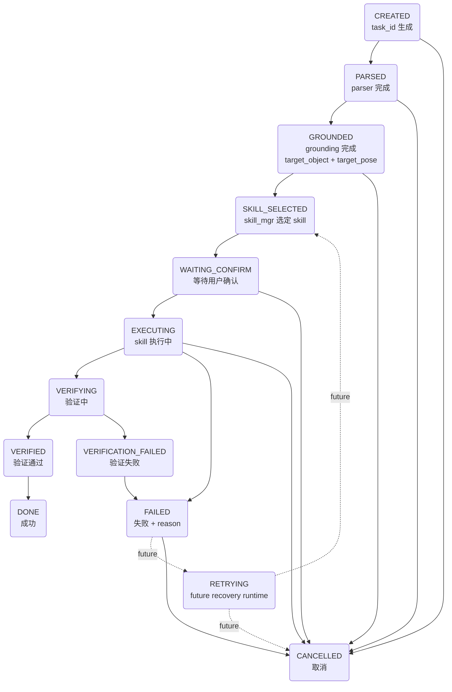

# Robot Runtime v0.1 — Task Schema

> 设计目标：定义统一的 TaskContext 数据结构、生命周期状态机、ROS2 通信格式
> 兼容：Teleop / Verification / RobotOps（P1-P3 逐步接入）

---

## 1. TaskContext 数据结构

```python
# sketch_runtime/task_context.py
from dataclasses import dataclass, field
from enum import Enum
from typing import Optional, Dict, Any, List
import time

class TaskState(Enum):
    # ── Task Lifecycle ─────────────────────
    CREATED = "created"                 # task_id 已生成
    PARSED = "parsed"                   # parser 完成
    GROUNDED = "grounded"               # grounding 完成

    # ── Runtime ───────────────────────────
    SKILL_SELECTED = "skill_selected"   # Skill 已选定
    WAITING_CONFIRM = "waiting_confirm" # 等待用户确认
    EXECUTING = "executing"             # Skill 执行中

    # ── Verification Runtime ─────────────
    VERIFYING = "verifying"             # 执行完成，等待验证
    VERIFIED = "verified"               # 验证通过
    VERIFICATION_FAILED = "verification_failed"  # 验证失败

    # ── Terminal States ──────────────────
    DONE = "done"                       # 最终成功（兼容旧系统）
    FAILED = "failed"                   # 执行失败
    CANCELLED = "cancelled"             # 用户取消

    # ── Extended Runtime ────────────────
    PAUSED = "paused"                   # Teleop 接管
    RETRYING = "retrying"               # 自动重试

@dataclass
class TaskContext:
    # ── 核心标识 ──
    task_id: str                              # "task_a1b2c3d4_1715900000"

    # ── 输入 ──
    user_command: str = ""                    # 原始输入："抓取红色杯子放到右边"
    source: str = "keyboard"                  # 来源: "keyboard" | "voice" | "teleop" | "web"

    # ── 解析结果 ──
    parsed_command: Optional[Dict] = None     # {action, from, to, raw}

    # ── Grounding 结果 ──
    target_object: Optional[Dict] = None      # TargetObject dict
    target_pose: Optional[Dict] = None        # {frame, xyz, rpy}

    # ── Skill 选择 ──
    selected_skill: str = ""                  # "pick_skill" | "place_skill" | "move_skill"
    skill_params: Dict = field(default_factory=dict)  # skill 特定参数

    # ── 状态 ──
    state: TaskState = TaskState.CREATED
    state_history: List[Dict] = field(default_factory=list)  # [{state, ts, detail}]

    # ── 结果 ──
    result: Optional[Dict] = None             # {success, reason, evidence}

    # ── 时间戳 ──
    created_at: float = field(default_factory=time.time)
    parsed_at: Optional[float] = None
    grounded_at: Optional[float] = None
    started_at: Optional[float] = None
    completed_at: Optional[float] = None

    # ── 控制 ──
    priority: int = 0                         # 0=normal, 1=high, 2=urgent (P1)
    retry_count: int = 0
    max_retries: int = 2

    # ── 元数据 ──
    metadata: Dict = field(default_factory=dict)  # 可扩展字段

    def transition(self, new_state: TaskState, detail: str = ""):
        old = self.state
        self.state = new_state
        self.state_history.append({
            "from": old.value,
            "to": new_state.value,
            "timestamp": time.time(),
            "detail": detail
        })
        if new_state == TaskState.PARSED:
            self.parsed_at = time.time()
        elif new_state == TaskState.GROUNDED:
            self.grounded_at = time.time()
        elif new_state == TaskState.EXECUTING:
            self.started_at = time.time()
        elif new_state in (TaskState.DONE, TaskState.FAILED, TaskState.CANCELLED):
            self.completed_at = time.time()

    @property
    def elapsed_ms(self) -> float:
        if self.completed_at:
            return (self.completed_at - self.created_at) * 1000
        return (time.time() - self.created_at) * 1000

    def to_dict(self) -> dict:
        return {
            "task_id": self.task_id,
            "state": self.state.value,
            "user_command": self.user_command,
            "source": self.source,
            "parsed_command": self.parsed_command,
            "selected_skill": self.selected_skill,
            "priority": self.priority,
            "retry_count": self.retry_count,
            "created_at": self.created_at,
            "elapsed_ms": self.elapsed_ms,
        }
```

---

## 2. 状态转移图



---

## 3. 状态转移规则表

| 从 | 到 | 触发条件 | 负责节点 |
|----|-----|----------|----------|
| `CREATED` | `PARSED` | `/parsed_command` 到达 | `runtime_state_node` |
| `CREATED` | `CANCELLED` | 用户取消 or 超时未收到 parsed | `runtime_state_node` |
| `PARSED` | `GROUNDED` | `/grounded_goal` 到达且 `status="ok"` | `runtime_state_node` |
| `PARSED` | `CANCELLED` | grounding 返回 `no_match` / `no_target` | `runtime_state_node` |
| `GROUNDED` | `SKILL_SELECTED` | `skill_manager` 映射成功 | `ground_executor_node` |
| `GROUNDED` | `CANCELLED` | 无可用 skill (unknown_skill) | `ground_executor_node` |
| `SKILL_SELECTED` | `WAITING_CONFIRM` | 预览已发布，等待用户确认 | `real_grounded_runtime_node` |
| `WAITING_CONFIRM` | `EXECUTING` | 用户确认 (`/runtime/confirm` yes) | `real_grounded_runtime_node` |
| `WAITING_CONFIRM` | `CANCELLED` | 用户取消 or 确认超时 | `real_grounded_runtime_node` |
| `EXECUTING` | `VERIFYING` | `skill.execute()` 完成 | `real_grounded_runtime_node` |
| `EXECUTING` | `FAILED` | `skill.execute()` returned success=false or raised exception | `real_grounded_runtime_node` |
| `EXECUTING` | `CANCELLED` | 用户取消 or ESTOP 触发 | `real_grounded_runtime_node` |
| `VERIFYING` | `VERIFIED` | verification precheck/postcheck 通过 | `verification_result_node` |
| `VERIFYING` | `VERIFICATION_FAILED` | verification 失败 | `verification_result_node` |
| `VERIFIED` | `DONE` | 验证成功，任务完成 | `real_grounded_runtime_node` |
| `VERIFICATION_FAILED` | `FAILED` | 验证失败，标记为失败 | `real_grounded_runtime_node` |
| `FAILED` | `CANCELLED` | 用户取消 | `real_grounded_runtime_node` |

---

## 4. ROS2 Topic 通信格式

### 4.1 `/runtime/state` — 任务状态广播

```json
{
  "task_id": "task_a1b2c3d4_1715900000",
  "state": "executing",
  "user_command": "抓取红色杯子放到右边",
  "source": "voice",
  "selected_skill": "pick_skill",
  "priority": 0,
  "retry_count": 0,
  "progress": {
    "step": 4,
    "total": 7,
    "description": "gripper_close_pick"
  },
  "created_at": 1715900000.0,
  "elapsed_ms": 3123.0,
  "timestamp": 1715900003.123
}
```

### 4.2 `/runtime/log` — 结构化事件日志

```json
{
  "task_id": "task_a1b2c3d4_1715900000",
  "event": "state_transition",
  "data": {
    "from": "skill_selected",
    "to": "executing",
    "detail": "skill pick_skill started, control authorized"
  },
  "timestamp": 1715900003.456
}
```

可选事件类型:
- `task_created`
- `state_transition`
- `parsed_command`
- `grounded_goal`
- `skill_selected`
- `ik_call` (p3 position + pitch + range → pulses)
- `servo_command` (pulses + duration + dry_run)
- `execution_step_completed`
- `execution_result`

### 4.3 `/runtime/execution_result` — 执行结果

```json
{
  "task_id": "task_a1b2c3d4_1715900000",
  "success": true,
  "reason": "pick_and_place_completed",
  "confidence": 0.92,
  "evidence": {
    "gripper_closed": true,
    "object_moved": true,
    "object_placed": true,
    "servo_reached": true,
    "duration_ms": 12300,
    "ik_calls": 6,
    "ik_failures": 0
  },
  "timestamp": 1715900015.789
}
```

---

## 5. 与 Teleop / RobotOps / Verification 的兼容设计

| 层 | 兼容点 |
|---|--------|
| **Teleop** | `source` 区分 `keyboard`/`voice`/`teleop`；`priority` 允许手动命令优先；`PAUSED` 状态为 Teleop 接管预留 |
| **RobotOps** | `state_history[]` 记录完整状态转移时间线；`/runtime/log` 按 `task_id` 分组聚合；`evidence` 持久化到 SQLite |
| **Verification** | `result.evidence` 供 Verification 节点填充；`retry_count`/`max_retries` 为未来 Retry / Recovery 预留，当前不自动重试 |
| **未来扩展** | `metadata: dict` 可承载 VLA 模型版本、IK 初始猜测、用户意图向量等字段，不改接口 |

---

## 6. Task 生命周期时序

```
time →
──────────────────────────────────────────────────────────────────────────────────────────
CREATED    PARSED   GROUNDED  SKILL_SEL  WAIT_CONF  EXECUTING  VERIFYING  VERIFIED   DONE
  │          │         │          │          │           │          │          │        │
  │.transition()       │          │          │           │          │          │        │
  ├─/parsed  │         │          │          │           │          │          │        │
  │          ├─/grounded_goal     │          │           │          │          │        │
  │          │         ├─skill_mgr.select()  │           │          │          │        │
  │          │         │         ├──preview──┤           │          │          │        │
  │          │         │         │   confirm─┤           │          │          │        │
  │          │         │         │          ├─execute()─┤          │          │        │
  │          │         │         │          │           ├─verify───┤          │        │
  │          │         │         │          │           │          ├─success──┤        │
  │          │         │         │          │           │          │          ├─done───┤
  │          │         │         │          │           │          ├─fail     │        │
  │          │         │         │          │           │          │          │        │
  │          │         │         │          │           │          └─> VERIFICATION_FAILED
  │          │         │         │          │           │                      │
  │          │         │         │          │           │                      └─> FAILED
  │          │         │         │          │           └─> FAILED             │
  │          │         │         │          └─> CANCELLED                      │
  │          │         │         └─> CANCELLED                                 │
  │          │         └─> CANCELLED                                           │
  │          └─> CANCELLED                                                     │
  └─> CANCELLED                                                                │
                                                                               │
/runtime/state on every transition                                              │
/runtime/log on every event                                                     │
/runtime/verification_result on VERIFYING → VERIFIED / VERIFICATION_FAILED      │
/runtime/execution_result on DONE / FAILED / CANCELLED                          │
```

---

## 7. 与现有 ground_executor_node 的兼容过渡

> Historical note: this section records the early Sprint 1 transition design. Current execution uses `real_grounded_runtime_node`, `PickSkill`, `RuntimeAdapter`, Preview/Confirm, Verification Runtime, and RobotOps.

```python
# 在 ground_executor_node.on_goal() 开头注入
def on_goal(self, msg):
    data = json.loads(msg.data)
    ctx = TaskContext(
        user_command=data.get("raw", ""),
        parsed_command=data,
    )
    ctx.transition(TaskState.GROUNDED)  # 当前阶段：直接从 grounded 进入

    # 发布 task_id + 状态
    self.pub_state.publish(String(data=json.dumps({
        "task_id": ctx.task_id,
        "state": ctx.state.value,
        ...
    })))

    # 原有逻辑不变（Sprint 2 再切换为 Skill 调度）
    self._handle_goal(data)

    # 执行完成后发布结果
    ctx.transition(TaskState.DONE)  # or FAILED
    self.pub_state.publish(...)
```

---

## 8. Mobile Task Extensions (Planned)

> **Status**: PLANNED — NOT IMPLEMENTED
>
> The following extensions are designed for the Mobile Robot Foundation (Phase B)
> and Mobile Manipulation Platform (Phase C) phases.
>
> Existing PickSkill and Runtime execution continue to use current fields.
> All mobile fields below are optional and planned.
> Do NOT require mobile fields for existing pick/place tasks.

### 8.1 Task Categories

| Task Type | Status | Example |
|-----------|--------|---------|
| pick | ✅ Implemented | pick blue cup |
| place | ✅ Implemented / existing path | place cup on right side |
| move | ⏳ Planned | go to kitchen |
| navigate | ⏳ Planned | navigate to map pose |
| search | ⏳ Planned | search for blue cup |

### 8.2 Proposed Optional Fields

| Field | Type | Status | Purpose |
|-------|------|--------|---------|
| `target_location` | string | ⏳ Planned | semantic location name such as "kitchen" |
| `goal_pose` | geometry_msgs/PoseStamped or dict | ⏳ Planned | map-frame navigation goal |
| `target_description` | string | ⏳ Planned | natural-language object/person search target |
| `frame_id` | string | ⏳ Planned | usually "map" for navigation |
| `map_id` | string | ⏳ Planned | map version used for semantic locations |
| `navigation_status` | string | ⏳ Planned | "pending" / "active" / "succeeded" / "failed" |

### 8.3 Task Examples

#### Existing Pick Task (current format)

```json
{
  "task_id": "task_001",
  "action": "pick",
  "target_object": {
    "label": "blue_cup",
    "source": "stable_world_model"
  }
}
```

#### Planned Move Task

```json
{
  "task_id": "task_move_001",
  "action": "move",
  "target_location": "kitchen",
  "frame_id": "map",
  "map_id": "home_map_01_260621"
}
```

#### Planned Navigate Task

```json
{
  "task_id": "task_nav_001",
  "action": "navigate",
  "goal_pose": {
    "frame_id": "map",
    "x": 1.2,
    "y": -0.8,
    "yaw": 1.57
  },
  "map_id": "home_map_01_260621"
}
```

#### Planned Search Task

```json
{
  "task_id": "task_search_001",
  "action": "search",
  "target_description": "blue cup",
  "search_area": "kitchen",
  "map_id": "home_map_01_260621"
}
```

### 8.4 Future Navigation Flow (Planned)

```
Natural language command
↓
ParsedCommand
↓
Grounding
↓
TaskContext
↓
SemanticLocationResolver
↓
MoveSkill / NavigateSkill
↓
Nav2
↓
RobotOps
```

### 8.5 Validation Status

- Mobile tasks are **NOT implemented yet**.
- MoveSkill / NavigateSkill / SearchSkill are **planned only**.
- Nav2 Goal Pose has **not been verified yet**.
- AMCL is **still in validation**.
- Existing PickSkill continues to work with the current schema.
- No mobile fields are required for existing pick/place tasks.
