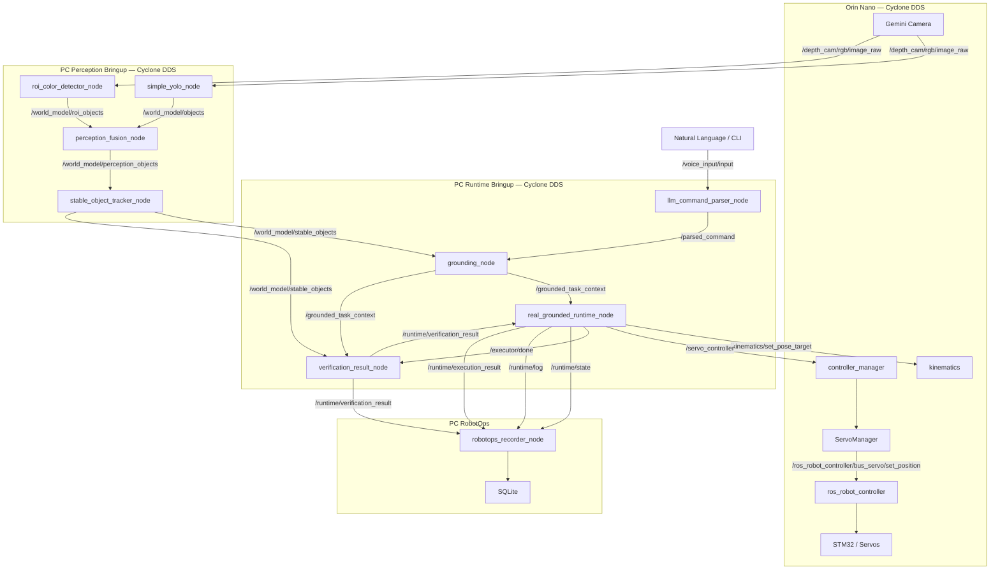

# JetArm ROS 2 Robot — Topic & Service Map

> **文档职责**：记录当前 ROS 2 节点、Topic、Service、Action、启动归属，以及 Current / Legacy / Planned 状态。  
> **当前基线日期**：2026-08-02  
> **当前主线**：真实相机 → 感知融合 → Stable World Model → 自然语言解析 → Grounding → Runtime → IK / Servo → Verification → RobotOps  
> **通信基线**：PC 与 Orin 新启动的 ROS 2 进程统一使用 Cyclone DDS，`ROS_DOMAIN_ID=23`。  
> **当前状态**：已完成一次真实视觉杯子抓取。  
>
> 启动、监听、确认和故障排查命令统一维护在：
>
> ```text
> docs/runtime_debug_guide.md
> ```
>
> 本文是通信拓扑和接口关系的 Source of Truth。

---

# 0. 当前系统边界

## 0.1 Orin

Orin 负责：

- Gemini 深度相机；
- Kinematics；
- `controller_manager`；
- `ServoManager`；
- `ros_robot_controller`；
- STM32 与舵机硬件执行。

Orin 主栈通过：

```text
start_app_node.service
→ source /home/ubuntu/.zshrc
→ ros2 launch bringup bringup.launch.py
```

自动启动。

当前 Orin 环境：

```bash
export ROS_DOMAIN_ID=23
export RMW_IMPLEMENTATION=rmw_cyclonedds_cpp
export CYCLONEDDS_URI=file:///home/ubuntu/ros2_ws/config/cyclonedds/orin_camera_eth0.xml
```

---

## 0.2 PC

PC 负责：

- YOLO；
- ROI；
- Perception Fusion；
- Stable Object Tracker；
- Parser；
- Grounding；
- Runtime；
- Verification；
- RobotOps；
- 调试和日志。

当前 PC 环境：

```bash
export ROS_DOMAIN_ID=23
export RMW_IMPLEMENTATION=rmw_cyclonedds_cpp
export CYCLONEDDS_URI=file:///home/sundasheng/ros2_ws/config/cyclonedds/pc_camera_eno1.xml
```

---

## 0.3 当前 Bringup 归属

### Orin Bringup

由 systemd 自动启动：

```text
Camera
Kinematics
controller_manager
ServoManager
ros_robot_controller
hardware drivers
```

### PC Perception Bringup

推荐入口：

```bash
./scripts/start_cyclone_perception.sh
```

内部启动：

```text
simple_yolo_node
roi_color_detector_node
perception_fusion_node
stable_object_tracker_node
```

当前不启动：

```text
grounding_node
real_grounded_runtime_node
verification_result_node
robotops_recorder_node
```

### PC Runtime Bringup

推荐入口：

```bash
ros2 launch sketch_runtime ground_runtime_bringup.launch.py ...
```

启动：

```text
llm_command_parser_node
grounding_node
real_grounded_runtime_node
verification_result_node
```

### RobotOps

独立启动：

```bash
ros2 launch robotops robotops_recorder.launch.py
```

---

# 1. 当前主线总图



---

# 2. 指令、Grounding 与 Runtime

## 2.1 当前执行链

```text
/voice_input/input
    ↓
llm_command_parser_node
    ↓
/parsed_command
    ↓
grounding_node
    ├─← /world_model/stable_objects
    └─→ /grounded_task_context
             ↓
real_grounded_runtime_node
    ├─→ /runtime/preview
    ├─← /runtime/confirm
    ├─→ /kinematics/set_pose_target
    ├─→ /servo_controller
    ├─→ /runtime/state
    ├─→ /runtime/log
    ├─→ /runtime/execution_result
    └─→ /executor/done
             ↓
verification_result_node
    └─→ /runtime/verification_result
```

---

## 2.2 `llm_command_parser_node`

### Subscribes

| Topic | Type | Purpose |
|---|---|---|
| `/keyboard_input/input` | `std_msgs/msg/String` | 键盘/Agent 文本输入 |
| `/voice_input/input` | `std_msgs/msg/String` | 语音或 CLI 自然语言输入 |

### Publishes

| Topic | Type | Purpose |
|---|---|---|
| `/parsed_command` | `std_msgs/msg/String` JSON | 结构化动作、对象和目标区域 |

典型输出：

```json
{
  "action": "pick",
  "from": "cup",
  "to": "right_side",
  "steps": [
    "move_to_source",
    "gripper_open",
    "gripper_close",
    "move_to_target",
    "gripper_open"
  ],
  "raw": "拿起杯子"
}
```

---

## 2.3 `grounding_node`

### Subscribes

| Topic | Type | Purpose |
|---|---|---|
| `/parsed_command` | `std_msgs/msg/String` JSON | 结构化用户任务 |
| `/world_model/stable_objects` | `std_msgs/msg/String` JSON | 当前稳定对象集合 |
| `/keyboard_input/input` | `std_msgs/msg/String` | Raw text fallback |

> `/keyboard_input/input` 同时可能进入 Parser 和 Grounding fallback。当前主线人工测试优先使用 `/voice_input/input`，避免双路径。

### Publishes

| Topic | Type | Purpose | Status |
|---|---|---|---|
| `/grounded_task_context` | `std_msgs/msg/String` JSON | 当前 Runtime 正式输入 | Current |
| `/grounded_goal` | `std_msgs/msg/String` JSON | Legacy Executor 输入 | Legacy-compatible |

### Services

| Service | Type | Purpose |
|---|---|---|
| `/grounding/clear_memory` | `std_srvs/srv/Trigger` | 清空 Grounding 内存 |

典型成功输出：

```json
{
  "intent": "pick",
  "object_hints": {
    "class": "cup",
    "color": null
  },
  "object_id": "track_002",
  "source_pose": {
    "frame": "base",
    "xyz": [0.236, -0.007, 0.041],
    "rpy": [0.0, 0.0, 1.57]
  },
  "target_pose": {
    "frame": "base",
    "xyz": [0.0, -0.2, 0.02],
    "rpy": [0.0, 0.0, 1.57]
  },
  "status": "ok"
}
```

---

## 2.4 `real_grounded_runtime_node`

### Subscribes

| Topic | Type | Purpose |
|---|---|---|
| `/grounded_task_context` | `std_msgs/msg/String` JSON | Grounded Task 输入 |
| `/runtime/confirm` | `std_msgs/msg/String` | 人工确认或取消 |
| `/runtime/verification_result` | `std_msgs/msg/String` JSON | Verification 回传 |

### Publishes

| Topic | Type | Purpose |
|---|---|---|
| `/runtime/preview` | `std_msgs/msg/String` JSON | 执行前预览 |
| `/runtime/state` | `std_msgs/msg/String` JSON | Task 状态 |
| `/runtime/log` | `std_msgs/msg/String` JSON | 当前结构化事件流 |
| `/runtime/execution_result` | `std_msgs/msg/String` JSON | Skill 执行结果 |
| `/executor/done` | `std_msgs/msg/Bool` | Skill 执行完成信号 |

### Clients

| Service | Type | Via |
|---|---|---|
| `/kinematics/set_pose_target` | `kinematics_msgs/srv/SetRobotPose` | `RuntimeAdapter` |

### Hardware command

| Topic | Type | Via |
|---|---|---|
| `/servo_controller` | `servo_controller_msgs/msg/ServosPosition` | `RuntimeAdapter` |

### 当前状态流

成功路径：

```text
grounded
→ skill_selected
→ waiting_confirm
→ executing
→ verifying
→ verified
```

失败路径：

```text
grounded
→ skill_selected
→ waiting_confirm
→ executing
→ verifying
→ verification_failed
```

---

## 2.5 `verification_result_node`

### Subscribes

| Topic | Type | Purpose |
|---|---|---|
| `/grounded_task_context` | `std_msgs/msg/String` JSON | 保存任务源位姿和目标 |
| `/world_model/stable_objects` | `std_msgs/msg/String` JSON | Precheck / Postcheck |
| `/executor/done` | `std_msgs/msg/Bool` | 触发执行后检查 |

### Publishes

| Topic | Type | Purpose |
|---|---|---|
| `/runtime/verification_result` | `std_msgs/msg/String` JSON | Precheck / Postcheck 结果 |

### 边界

`verification_result_node`：

- 不控制机械臂；
- 不调用 IK；
- 不发布 `/servo_controller`；
- 不阻塞 Runtime 的真实动作发送。

当前已知限制：

- 在 `enable_real_servo=false` 时曾出现假阳性；
- 单次 Tracker 丢失可能被判定为物体离开；
- 需要后续增加连续多帧确认与执行模式门控。

---

# 3. 感知与 Stable World Model

## 3.1 感知数据流

```text
/depth_cam/rgb/image_raw
    ├─→ simple_yolo_node
    │       ├─→ /vision_target
    │       └─→ /world_model/objects
    │
    └─→ roi_color_detector_node
            ├─→ /roi_color_detector/image_result
            ├─→ /roi_vision_target
            ├─→ /world_model/roi_objects
            ├─→ /roi_objects/poses
            └─→ /roi_target_pose

/world_model/objects
+
/world_model/roi_objects
    ↓
perception_fusion_node
    ↓
/world_model/perception_objects
    ↓
stable_object_tracker_node
    ↓
/world_model/stable_objects
```

---

## 3.2 `simple_yolo_node`

> 历史文档中曾称为 `app_compatible_yolo_node`。当前运行入口和节点名以 `simple_yolo_node` 为准。

### Subscribes

| Topic | Type |
|---|---|
| `/depth_cam/rgb/image_raw` | `sensor_msgs/msg/Image` |
| `/depth_cam/depth/camera_info` | `sensor_msgs/msg/CameraInfo` |

### Clients

| Service | Type |
|---|---|
| `/kinematics/get_current_pose` | `kinematics_msgs/srv/GetRobotPose` |

### Publishes

| Topic | Type |
|---|---|
| `/vision_target` | `vision_interfaces/msg/DetectionResult` |
| `/world_model/objects` | `std_msgs/msg/String` JSON |

2026-08-02 实测示例：

```json
{
  "id": 1,
  "class_name": "cup",
  "pose": {
    "frame": "base",
    "xyz": [0.237, -0.007, 0.041],
    "rpy": [0.0, 0.0, 1.57]
  },
  "confidence": 0.959
}
```

---

## 3.3 `roi_color_detector_node`

### Subscribes

| Topic | Type |
|---|---|
| `/depth_cam/rgb/image_raw` | `sensor_msgs/msg/Image` |
| `/depth_cam/rgb/camera_info` | `sensor_msgs/msg/CameraInfo` |

### Publishes

| Topic | Type | Purpose |
|---|---|---|
| `/roi_color_detector/image_result` | `sensor_msgs/msg/Image` | 调试图像 |
| `/roi_vision_target` | `vision_interfaces/msg/DetectionResult` | 调试结果 |
| `/world_model/roi_objects` | `std_msgs/msg/String` JSON | Fusion 输入 |
| `/roi_objects/poses` | `geometry_msgs/msg/PoseArray` | 调试 |
| `/roi_target_pose` | `geometry_msgs/msg/PoseStamped` | 调试 |

当前已知风险：

```text
真实杯子存在时，ROI 曾间歇性输出：
class_name = cube
color = white
xyz = [0.185, -0.011, 0.034]
```

因此 ROI 是候选位姿和颜色源，不应被视为绝对真值。

---

## 3.4 `perception_fusion_node`

### Subscribes

| Topic | Type |
|---|---|
| `/world_model/objects` | `std_msgs/msg/String` JSON |
| `/world_model/roi_objects` | `std_msgs/msg/String` JSON |

### Publishes

| Topic | Type |
|---|---|
| `/world_model/perception_objects` | `std_msgs/msg/String` JSON |

### 当前 Fusion 规则

| 输入情况 | `class_name` | `color` | `pose` | `source` |
|---|---|---|---|---|
| YOLO + ROI 匹配 | YOLO | ROI | ROI | `yolo_roi_fused` |
| YOLO only | YOLO | `unknown` | YOLO | `yolo_only` |
| ROI only | ROI | ROI | ROI | `roi_only` |

2026-08-02 稳定阶段实测：

```json
{
  "class_name": "cup",
  "color": "unknown",
  "pose": {
    "frame": "base",
    "xyz": [0.237, -0.007, 0.041],
    "rpy": [0.0, 0.0, 1.57]
  },
  "confidence": 0.961,
  "source": "yolo_only",
  "id": 1
}
```

---

## 3.5 `stable_object_tracker_node`

### Subscribes

| Topic | Type |
|---|---|
| `/world_model/perception_objects` | `std_msgs/msg/String` JSON |

### Publishes

| Topic | Type |
|---|---|
| `/world_model/stable_objects` | `std_msgs/msg/String` JSON |

2026-08-02 实测：

```json
{
  "track_id": "track_002",
  "class_name": "cup",
  "color": "unknown",
  "pose": {
    "frame": "base",
    "xyz": [0.237, -0.007, 0.041],
    "rpy": [0.0, 0.0, 1.57]
  },
  "confidence": 0.959,
  "confidence_smooth": 0.958,
  "frames_tracked": 32,
  "class_votes": {
    "cup": 20
  },
  "color_votes": {
    "unknown": 20
  },
  "source_votes": {
    "yolo_only": 20
  }
}
```

---

# 4. Topic 速查表

## 4.1 Current 主线

| Topic | Type | Publisher | Subscriber | Started By | Status |
|---|---|---|---|---|---|
| `/depth_cam/rgb/image_raw` | `sensor_msgs/msg/Image` | Orin Camera | YOLO、ROI、其他视觉节点 | Orin Bringup | Current |
| `/depth_cam/rgb/camera_info` | `sensor_msgs/msg/CameraInfo` | Orin Camera | ROI、AprilTag 等 | Orin Bringup | Current |
| `/depth_cam/depth/camera_info` | `sensor_msgs/msg/CameraInfo` | Orin Camera | YOLO、Calibration | Orin Bringup | Current |
| `/vision_target` | `vision_interfaces/msg/DetectionResult` | `simple_yolo_node` | Debug、Legacy Executor、环境节点 | Perception Bringup | Current debug |
| `/world_model/objects` | `std_msgs/msg/String` JSON | `simple_yolo_node`；Dummy/TF 测试源 | Fusion、部分社交节点 | Perception Bringup | Current |
| `/roi_color_detector/image_result` | `sensor_msgs/msg/Image` | ROI | Debug | Perception Bringup | Current debug |
| `/roi_vision_target` | `vision_interfaces/msg/DetectionResult` | ROI | Debug | Perception Bringup | Current debug |
| `/world_model/roi_objects` | `std_msgs/msg/String` JSON | ROI | Fusion | Perception Bringup | Current candidate |
| `/roi_objects/poses` | `geometry_msgs/msg/PoseArray` | ROI | Debug | Perception Bringup | Current debug |
| `/roi_target_pose` | `geometry_msgs/msg/PoseStamped` | ROI | Debug | Perception Bringup | Current debug |
| `/world_model/perception_objects` | `std_msgs/msg/String` JSON | Fusion | Stable Tracker | Perception Bringup | Current |
| `/world_model/stable_objects` | `std_msgs/msg/String` JSON | Stable Tracker | Grounding、Verification | Perception Bringup | Current |
| `/voice_input/input` | `std_msgs/msg/String` | Voice Agent / CLI | Parser；部分社交节点 | Voice Stack / Manual | Current |
| `/keyboard_input/input` | `std_msgs/msg/String` | Voice Agent | Parser、Grounding fallback | Voice Stack | Current with dual-path risk |
| `/parsed_command` | `std_msgs/msg/String` JSON | Parser | Grounding | Runtime Bringup | Current |
| `/grounded_task_context` | `std_msgs/msg/String` JSON | Grounding | Runtime、Verification | Runtime Bringup | Current |
| `/runtime/preview` | `std_msgs/msg/String` JSON | Runtime | UI / CLI / Logger | Runtime Bringup | Current |
| `/runtime/confirm` | `std_msgs/msg/String` | Operator / UI | Runtime | Manual | Current |
| `/runtime/state` | `std_msgs/msg/String` JSON | Runtime | RobotOps / Dashboard | Runtime Bringup | Current |
| `/runtime/log` | `std_msgs/msg/String` JSON | Runtime | RobotOps / CLI | Runtime Bringup | Current event stream |
| `/runtime/execution_result` | `std_msgs/msg/String` JSON | Runtime | RobotOps / CLI | Runtime Bringup | Current |
| `/runtime/verification_result` | `std_msgs/msg/String` JSON | Verification | Runtime、RobotOps | Runtime Bringup | Current |
| `/executor/done` | `std_msgs/msg/Bool` | Runtime | Verification、Done Sayer | Runtime Bringup | Current |
| `/servo_controller` | `servo_controller_msgs/msg/ServosPosition` | RuntimeAdapter、`grasp`、社交节点、Legacy Executor | `controller_manager` | Multiple | Current hardware command |
| `/joint_controller` | `sensor_msgs/msg/JointState` | External Controller | `controller_manager` | Optional | Current |
| `/controller_manager/joint_states` | `sensor_msgs/msg/JointState` | `controller_manager` | Debug、Legacy Executor | Orin Bringup | Current |
| `/controller_manager/servo_states` | `servo_controller_msgs/msg/ServoStateList` | `controller_manager` | Debug | Orin Bringup | Current |
| `/ros_robot_controller/bus_servo/set_position` | `servo_controller_msgs/msg/ServosPosition` | `ServoManager`；Legacy Executor 可直连 | `ros_robot_controller` | Orin Bringup | Current lower-level |
| `/grasp` | `servo_controller_msgs/msg/Grasp` | External Trigger | `grasp` | Optional | Optional |

---

## 4.2 Voice / Social

| Topic | Type | Publisher | Subscriber |
|---|---|---|---|
| `/text_input` | `std_msgs/msg/String` | `keyboard_input_node` | Voice Agent 或 remap |
| `/speech_query` | `std_msgs/msg/String` | ASR | Voice Agent |
| `/speech_reply` | `std_msgs/msg/String` | Voice Agent、ASR sleep、Done Sayer | ASR、TTS |
| `/tts_speaking` | `std_msgs/msg/Bool` | TTS | ASR |
| `/tts/done` | `std_msgs/msg/Bool` | TTS | Voice Agent |
| `/tts/interrupt` | `std_msgs/msg/Bool` | Voice Agent、ASR | TTS |
| `/voice_agent/state` | `std_msgs/msg/String` | Voice Agent | Debug / UI |
| `/gesture/cmd` | `std_msgs/msg/String` | Voice Agent | Gesture Player |
| `/face_follow/control` | `std_msgs/msg/String` | Voice Agent、Gesture、Env Nodes | Face Follow |
| `/face_follow/status` | `std_msgs/msg/String` | Face Follow | Gesture、Env Scan |
| `/env_objects` | `EnvObjectArray` | Env Scan、Static Env Report | Voice Agent、World Model |
| `/world_objects` | `EnvObjectArray` | Social World Model | Consumers TBD |

---

## 4.3 Legacy

| Topic | Type | Publisher | Subscriber | Status |
|---|---|---|---|---|
| `/grounded_goal` | String JSON | Grounding | `ground_executor_node` | Legacy |
| `/executor/preview` | String | Legacy Executor | UI / Logger | Legacy |
| `/executor/preview_text` | String | Legacy Executor | UI | Legacy |
| `/executor/preview_step` | String | Legacy Executor | UI | Legacy |
| `/executor/preview_steps_json` | String | Legacy Executor | UI | Legacy |
| `/executor/preview_full_text` | String | Legacy Executor | UI | Legacy |
| `/executor/confirm` | Bool | Operator | Legacy Executor | Legacy |
| `/executor/confirm_str` | String | Operator | Legacy Executor | Legacy |

Current 对应关系：

```text
Legacy /grounded_goal
→ Current /grounded_task_context

Legacy /executor/preview*
→ Current /runtime/preview

Legacy /executor/confirm*
→ Current /runtime/confirm
```

> 不要同时启动 `ground_executor_node` 和 `real_grounded_runtime_node` 执行同一任务。

---

# 5. Service 速查表

| Service | Type | Server | Client | Location | Status |
|---|---|---|---|---|---|
| `/kinematics/set_pose_target` | `kinematics_msgs/srv/SetRobotPose` | `kinematics` | RuntimeAdapter、`grasp`、Legacy Executor | Orin | Current，跨机已验证 |
| `/kinematics/get_current_pose` | `kinematics_msgs/srv/GetRobotPose` | `kinematics` | YOLO、Object Pose、Calibration | Orin | Current，跨机已验证 |
| `/grounding/clear_memory` | `std_srvs/srv/Trigger` | Grounding | External Debug | PC | Current |
| `/ros_robot_controller/init_finish` | `std_srvs/srv/Trigger` | `ros_robot_controller` | `controller_manager` | Orin | Current |
| `~/init_finish` | `std_srvs/srv/Trigger` | `controller_manager` | External Status Check | Orin | Runtime name must be verified |
| `ros_robot_controller/bus_servo/get_state` | `GetBusServoState` | `ros_robot_controller` | `ServoManager` | Orin | Current |
| `~/enter` | `std_srvs/srv/Trigger` | Calibration | Calibration Tool | PC | Optional |
| `~/exit` | `std_srvs/srv/Trigger` | Calibration | Calibration Tool | PC | Optional |
| `~/start` | `std_srvs/srv/Trigger` | Calibration | Calibration Tool | PC | Optional |

> `~` 是私有命名空间。绝对名称应以运行时 `ros2 service list` 和 `ros2 node info` 为准。

---

# 6. Action 速查表

| Action | Type | Server | Client | Status |
|---|---|---|---|---|
| `/arm_controller/follow_joint_trajectory` | `control_msgs/action/FollowJointTrajectory` | `controller_manager` | MoveIt / External | Available，Current Runtime 未使用 |
| `/gripper_controller/follow_joint_trajectory` | `control_msgs/action/FollowJointTrajectory` | `controller_manager` | MoveIt / External | Available，Current Runtime 未使用 |
| Nav2 `NavigateToPose` | `nav2_msgs/action/NavigateToPose` | Nav2 | Future NavigateSkill | Not verified |
| Nav2 `FollowWaypoints` | `nav2_msgs/action/FollowWaypoints` | Nav2 | Future | Not verified |

---

# 7. 底层控制路径

## 7.1 Current Runtime

```text
real_grounded_runtime_node
    ↓
SkillManager
    ↓
PickSkill
    ↓
RuntimeAdapter
    ├─→ /kinematics/set_pose_target
    └─→ /servo_controller
             ↓
       controller_manager
             ↓
         ServoManager
             ↓
/ros_robot_controller/bus_servo/set_position
             ↓
    ros_robot_controller
             ↓
            STM32
             ↓
          Servos
```

Current Runtime 不直接发布：

```text
/ros_robot_controller/bus_servo/set_position
```

---

## 7.2 Legacy Ground Executor

```text
ground_executor_node
    ├─→ /servo_controller
    └─→ /ros_robot_controller/bus_servo/set_position
```

Legacy Executor 可绕过 `controller_manager` 直连底层硬件总线，因此属于高风险历史路径。

---

## 7.3 `/servo_controller` 多写者

可能发布 `/servo_controller` 的节点包括：

- Current RuntimeAdapter；
- `grasp`；
- `llm_voice_agent`；
- `face_follow_node`；
- `env_scan_node`；
- `gesture_player_node`；
- Legacy `ground_executor_node`。

当前没有正式控制权仲裁。

真实抓取时应避免同时运行可能主动控制机械臂的其他节点。

---

# 8. 已验证真实 Pick 接口事实

2026-08-02 完成一次真实视觉杯子抓取。

## 8.1 Grounding 输入

```text
class_name = cup
color = unknown
frame = base
xyz ≈ [0.236, -0.007, 0.041]
```

## 8.2 真实 IK

Hover：

```text
position = [0.236, -0.007, 0.121]
pulse = [492, 354, 414, 59, 504]
```

Approach：

```text
position = [0.236, -0.007, 0.015]
pulse = [492, 343, 240, 207, 504]
```

Lift：

```text
position = [0.236, -0.007, 0.121]
pulse = [492, 354, 414, 59, 504]
```

## 8.3 夹爪

| Servo | Pulse | Action |
|---|---:|---|
| ID10 | `200` | Open |
| ID10 | `700` | Close |

## 8.4 结果

```text
Camera：PASS
YOLO：PASS
Fusion：PASS
Stable Tracker：PASS
Parser：PASS
Grounding：PASS
Confirm：PASS
Real IK：PASS
Real Servo：PASS
Pick：PASS
```

---

# 9. RobotOps

## 9.1 `robotops_recorder_node`

### Subscribes

| Topic | Purpose |
|---|---|
| `/runtime/state` | Task 状态 |
| `/runtime/log` | 结构化事件流 |
| `/runtime/execution_result` | 执行结果 |
| `/runtime/verification_result` | 验证结果 |

### Persistence

```text
SQLite
```

当前没有独立：

```text
/runtime/event
```

`/runtime/log` 是当前 Runtime 事件流。

数据库实际路径应以 Launch 参数和启动日志为准。

---

# 10. Mobile Robot Foundation

## 10.1 Mobile Base Topics

| Topic | Type | Publisher | Subscriber | Status |
|---|---|---|---|---|
| `/cmd_vel` | `geometry_msgs/msg/Twist` | Manual Teleop；Nav2 planned | `turn_on_dlrobot_robot` | Manual verified |
| `/odom_combined` | `nav_msgs/msg/Odometry` | `turn_on_dlrobot_robot` | TF Bridge、SLAM、AMCL、RViz | Verified |
| `/scan` | `sensor_msgs/msg/LaserScan` | `rplidar_node` | SLAM、AMCL | Verified |
| `/mobile_base/sensors/imu_data` | `sensor_msgs/msg/Imu` | Robot IMU Publisher | Current upper-layer unused | Topic verified |
| `/tf` | `tf2_msgs/msg/TFMessage` | TF Bridge 等 | RViz、SLAM、AMCL | Verified |
| `/tf_static` | `tf2_msgs/msg/TFMessage` | Static TF Publishers | All TF consumers | Verified |
| `/map` | `nav_msgs/msg/OccupancyGrid` | `slam_toolbox` / `map_server` | RViz、AMCL | Verified |
| `/map_metadata` | `nav_msgs/msg/MapMetaData` | `map_server` | RViz | Verified |
| `/initialpose` | `geometry_msgs/msg/PoseWithCovarianceStamped` | RViz | AMCL | Verified |
| `/amcl_pose` | `geometry_msgs/msg/PoseWithCovarianceStamped` | AMCL | RViz、Nav2 | In validation |
| `/particle_cloud` | `geometry_msgs/msg/PoseArray` | AMCL | RViz | In validation |
| `/goal_pose` | `geometry_msgs/msg/PoseStamped` | RViz | Nav2 | Not verified |
| `/plan` | `nav_msgs/msg/Path` | Nav2 | RViz | Not verified |

---

## 10.2 Mobile Base 数据流

```text
/cmd_vel
    ↓
turn_on_dlrobot_robot
    ↓
/odom_combined
    ↓
odom_tf_bridge_node
    ↓
/tf

rplidar_node
    ↓
/scan

/scan + /tf
    ↓
slam_toolbox
    ↓
/map

/map + /scan + /tf + /initialpose
    ↓
AMCL
    ↓
/amcl_pose + /particle_cloud + map→odom
```

---

## 10.3 当前状态

| Module | Status |
|---|---|
| Mobile Base Driver | Verified |
| Lidar | Verified |
| SLAM Mapping | Complete |
| AMCL | In validation |
| Nav2 | Not verified |
| MoveSkill | Missing |
| Semantic Locations | Missing |
| Mobile Manipulation | Planned |

---

# 11. 数据格式速查

## 11.1 `kinematics_msgs/srv/SetRobotPose`

```text
request:
  float64[] position
  float64 pitch
  float64[] pitch_range
  float64 resolution

response:
  bool success
  uint16[] pulse
  uint16[] current_pulse
  float64[] rpy
  float64 min_variation
```

## 11.2 `kinematics_msgs/srv/GetRobotPose`

```text
request:
  empty

response:
  bool success
  bool solution
  geometry_msgs/msg/Pose pose
```

## 11.3 `vision_interfaces/msg/DetectionResult`

```text
string[] class_name
float32[] confidence
int32[] center_x
int32[] center_y
float32[] center_z
int32[] image_width
int32[] image_height
```

## 11.4 `servo_controller_msgs/msg/Grasp`

```text
string mode
float64[] position
uint16 pitch
float64 angle
uint16 gripper
uint16 grasp_posture
uint16 pre_grasp_posture
```

## 11.5 `servo_controller_msgs/msg/ServosPosition`

```text
float64 duration
string position_unit
servo_controller_msgs/msg/ServoPosition[] position
```

`position_unit`：

```text
pulse
rad
deg
```

---

# 12. 当前已知问题

## 12.1 ROI 间歇性误检

ROI 曾将真实杯子附近区域输出为：

```text
cube / white
xyz=[0.185, -0.011, 0.034]
```

同时 YOLO 输出：

```text
cup
xyz=[0.237, -0.007, 0.041]
```

风险：

```text
YOLO class
+
wrong ROI pose
→ wrong yolo_roi_fused object
→ Stable pose jump
→ Grounding wrong source pose
```

---

## 12.2 Color `unknown`

当 ROI 没有有效匹配时：

```text
source = yolo_only
color = unknown
```

因此：

```text
拿起蓝色杯子
```

可能 `no_match`，而：

```text
拿起杯子
```

可以正常匹配。

---

## 12.3 Verification 假阳性

在：

```text
enable_real_servo=false
```

机械臂未执行时，曾出现：

```text
object_no_longer_at_source
state=verified
```

Verification 需要后续增加：

- 执行模式门控；
- 连续多帧确认；
- Tracker 丢失与真实物体位移区分；
- 与 Servo 执行结果关联。

---

## 12.4 Grounding yaw 未传入 Runtime IK

曾观察：

```text
Grounding source_pose.rpy = [0.0, 0.0, 1.57]
Runtime IK request rpy    = [0.0, 0.0, 0.0]
```

圆形杯子抓取已成功，但方向敏感目标仍需处理。

---

## 12.5 临时 IK Node 警告

Runtime 真实 IK 调用可能输出：

```text
creating temp IK node
Publisher already registered for provided node name
```

当前不影响 IK 成功，但应后续复用持久 IK Client，或使用唯一临时节点名。

---

## 12.6 Cyclone DDS XML 弃用警告

```text
NetworkInterfaceAddress: deprecated element
```

当前不影响：

- Topic；
- Service；
- Camera；
- Real IK；
- Real Servo。

已验证 XML 暂不原地修改。

---

# 13. Current / Legacy / Planned 定义

| Status | Meaning |
|---|---|
| Current | 当前主线使用并已接入 |
| Optional | 可选功能，不属于最小主线 |
| Legacy | 历史执行链，不应与 Current 同时运行 |
| In validation | 已实现但仍在验证 |
| Not verified | 可能存在接口，但尚未完成运行验收 |
| Planned | 尚未实现 |

---

# 14. 文档维护规则

发生以下变化时必须更新本文：

- Bringup 增加或删除节点；
- Topic 名称、类型或 QoS 变化；
- Service 客户端或服务端变化；
- Runtime Confirm 接口变化；
- RuntimeAdapter 控制路径变化；
- Perception Fusion 策略变化；
- RobotOps 订阅或数据库结构变化；
- Legacy 节点下线；
- Nav2 / MoveSkill 完成验收。

启动、监听、确认和排查命令不在本文重复维护，统一见：

```text
docs/runtime_debug_guide.md
```

系统架构图和阶段设计统一见：

```text
docs/runtime_architecture.md
```

风险统一见：

```text
docs/runtime_risks.md
```

具体开发过程统一记录在：

```text
docs/dev_log/
```

---

# 15. 当前验收状态

| Module | Status |
|---|---|
| PC / Orin Cyclone DDS | ✅ Verified |
| Cross-host Camera Topic | ✅ Verified |
| Cross-host Kinematics Service | ✅ Verified |
| YOLO | ✅ Verified |
| ROI | 🔶 Working，存在间歇性误检 |
| Perception Fusion | ✅ Working |
| Stable Tracker | ✅ Working |
| Parser | ✅ Verified |
| Grounding | ✅ Verified |
| Runtime Confirm | ✅ Verified |
| Dry-run | ✅ Verified |
| Real IK | ✅ Verified |
| Real Servo | ✅ Verified |
| First Real Cup Pick | ✅ Complete |
| RobotOps | ✅ Implemented，真实任务写入待核查 |
| Verification | 🔶 In validation |
| Pick Repeatability | 🔶 To validate |
| PlaceSkill | ❌ Not verified |
| AMCL | 🔶 In validation |
| Nav2 | ❌ Not verified |
| MoveSkill | ❌ Missing |
| Semantic Locations | ❌ Missing |
